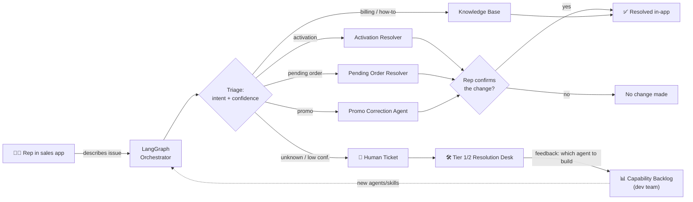

# Rep Assist — Conversational Assisted Sales & Service for Retail Reps

Rep Assist is a conversational **Assisted Sales & Service** assistant embedded in
the retail sales application. A retail rep describes an order or service problem
in plain language; a **LangGraph orchestrator** triages it, routes it to the right
existing agent (Activation Resolver, Promo Correction Agent, Pending Order
Resolver, …), confirms any account-changing action with the rep, and — when no
agent or knowledge can solve it — opens a **human-in-the-loop ticket** that
replaces ServiceNow. Tier 1/2 specialists resolve those tickets and leave
structured feedback that becomes a **prioritized backlog of agents/skills** the
dev team should build next, so the assistant keeps getting better.

> This repository is a **runnable reference implementation**: a real LangGraph
> orchestrator, a rep chat UI, the Tier 1/2 resolution desk, mocked "existing
> agent" microservices, and a feedback/analytics loop. It runs locally with
> **zero credentials** (deterministic mock LLM) and lights up real Claude
> reasoning the moment you add an `ANTHROPIC_API_KEY`.

---

## What's in the box

| Layer | Tech | Folder |
|---|---|---|
| Rep chat UI + Tier 1/2 desk + dashboards | React + Vite + TypeScript | [`frontend/`](frontend/) |
| Conversational orchestrator | LangGraph + FastAPI | [`backend/app/graph`](backend/app/graph), [`backend/app/api`](backend/app/api) |
| **A2UI** (agent-to-UI) elements + stubbed MCP layer | FastAPI + React | [`backend/app/mcp`](backend/app/mcp), [`frontend/src/components/A2UI.tsx`](frontend/src/components/A2UI.tsx) |
| "Existing" agents (mocked microservices) | FastAPI | [`backend/app/mock_services`](backend/app/mock_services) |
| HITL ticketing + feedback store (ServiceNow replacement) + **AI Assisted Resolution Desk** (Claude ticket triage → education/agent_action/system_defect, one-click resolution) | SQLite + SQLModel + Claude | [`backend/app/store`](backend/app/store), [`backend/app/api/tickets.py`](backend/app/api/tickets.py) |
| Observability (CX Monitor) + email reports | LangSmith + smtplib | [`backend/app/api/cx.py`](backend/app/api/cx.py), [`backend/app/api/email_reports.py`](backend/app/api/email_reports.py) |
| **Production Monitor** — live escalation inflow, AI issue clustering, alerts, JIRA-stub defects | FastAPI SSE + Claude | [`backend/app/api/production.py`](backend/app/api/production.py), [`frontend/src/components/ProductionDashboard.tsx`](frontend/src/components/ProductionDashboard.tsx) |
| **Store Check-In & Queue** + **Live Listen** — front-desk intake, and a read-only AI copilot over the live conversation (Playbook scoring, GenAI coaching, visit-summary email) | FastAPI + React + Claude | [`backend/app/api/queue.py`](backend/app/api/queue.py), [`backend/app/api/listen.py`](backend/app/api/listen.py), [`backend/app/api/coaching.py`](backend/app/api/coaching.py), [`backend/app/api/playbook.py`](backend/app/api/playbook.py) |
| **Training & Enablement** — one "Show me how" (auto-generated steps + animated demo GIF + uploaded video), AI storyboard generator | FastAPI + React + Claude | [`backend/app/api/training.py`](backend/app/api/training.py), [`backend/app/mcp/system_stub.py`](backend/app/mcp/system_stub.py) |
| **In-Chat Shopping + POS Checkout** — chat-built cart (protection / perks / accessories / trade-in), View Together bill review, simulated payment + signature, QR/SMS phone hand-off; plus **Guided Demos** (full sales/service visits, chat or Live Listen) | FastAPI + React + Claude + segno | [`backend/app/shop.py`](backend/app/shop.py), [`backend/app/checkout.py`](backend/app/checkout.py), [`frontend/src/components/Checkout.tsx`](frontend/src/components/Checkout.tsx), [`frontend/src/demos.ts`](frontend/src/demos.ts) |
| LLM access (Claude + offline fallback) | official `anthropic` SDK | [`backend/app/llm.py`](backend/app/llm.py) |
| Cloud Run deployment (one service, API + UI) | Docker + gcloud | [`deploy.sh`](deploy.sh), [`backend/Dockerfile`](backend/Dockerfile) |
| Architecture, diagrams, runbook, roadmap | Markdown + Mermaid | [`docs/`](docs/) |

## Documentation

1. [Executive Summary](docs/00-executive-summary.md) — the one-pager for leadership.
2. [Solution Architecture](docs/01-solution-architecture.md) — context/container/sequence diagrams, data model, security.
3. [LangGraph Orchestration](docs/02-langgraph-orchestration.md) — the graph, state, nodes, and the human-in-the-loop interrupt.
4. [HITL Ticketing Workflow](docs/03-hitl-ticketing-workflow.md) — how this replaces ServiceNow, plus the AI Assisted Resolution Desk that Claude-classifies the backlog into education / agent_action / system_defect with a one-click resolution per bucket.
5. [Feedback & Continuous Improvement](docs/04-feedback-and-continuous-improvement.md) — turning Tier 1/2 feedback into a dev backlog.
6. [Local Setup Runbook](docs/05-local-setup-runbook.md) — step-by-step to run everything.
7. [Roadmap & What You Need To Do](docs/06-roadmap-and-what-you-need-to-do.md) — productionization plan and your task list.
8. [Real Agent Integration — Worked Example](docs/07-real-agent-integration-example.md) — how to swap a mock for a real, vendor-shaped agent (implemented for Activation).
9. [Operations & KPI Dashboard](docs/08-operations-dashboard.md) — engagement, escalations, resolutions, and all operational KPIs.
10. [CX Monitor — LangSmith Integration](docs/09-cx-monitor.md) — conversation latency, token usage, cost-per-conversation, and live trace explorer.
11. [A2UI — Agent-to-UI Elements](docs/10-a2ui-generative-ui.md) — generative UI in the chat (recent orders) sourced from a stubbed MCP layer.
12. [Email Reports & Settings](docs/11-email-reports.md) — on-demand HTML dashboard reports, subscriber management, SMTP + preview mode.
13. [Deployment — Google Cloud Run](docs/12-deployment-cloud-run.md) — one service serving API + UI, Secret Manager, and synthetic-data seeding.
14. [System Health & Live Notifications](docs/13-system-health.md) — the topbar status badge, operator-set incidents, and real-time SSE toast notifications.
15. [Production Monitor](docs/14-production-monitoring.md) — real-time escalation inflow, AI issue clustering, critical email alerts, and auto-filed JIRA defects (stub MCP).
16. [System Enhancements Generation](docs/15-system-enhancements-generation.md) — the "What's new" card, regenerated from git commit history on every deploy instead of hand-maintained.
17. [Observability](docs/16-observability.md) — conversation health, guardrail integrity (incl. log-only prompt-injection detection), true token economics (cost by intent/outcome), sales-intent segmentation, and a fallback-rate alert wired to System Health, added to CX Monitor.
18. [Reseeding the Deployed Environment](docs/17-reseeding-deployed-data.md) — the exact runbook for repopulating demo data after a deploy, plus a matching Claude Code skill.
19. [Store Check-In & Queue](docs/19-store-checkin-queue.md) — front-of-store customer intake (visit reason + name/phone), a live queue card, and one-tap "Assist" hand-off into the normal chat flow.
20. [Live Listen](docs/20-live-listen.md) — a read-only AI copilot over a live rep–customer conversation: suggestion cards that hand off into the normal chat, a Playbook score at the end of the visit, GenAI per-rep coaching, and a one-tap customer visit-summary email.
21. [Training & Enablement](docs/21-training-and-enablement.md) — one "Show me how" per feature combining auto-generated steps, an animated demo GIF, and an uploaded training video, plus an AI storyboard/narration generator.
22. [Live Queue](docs/22-live-queue.md) — real-time floor snapshot: waiting, being assisted, in-store pickups, and today's appointments, in a topbar indicator + popup.
23. [CES Agent Routing](docs/23-ces-agent-routing.md) — relay selected triage intents to an external Google CX Agent Studio (CES) agent, switched on per-intent from Settings, built on `runSession` with an offline stub.
24. [In-Chat Shopping + POS Checkout](docs/24-in-chat-shopping.md) — a chat-built cart (add a line / upgrade + protection / perks / accessories / trade-in) with an always-on protection recommendation, then a full POS checkout: a **View Together** bill review (current vs. new vs. blended + one-time due today), a simulated payment, a captured signature, and a **phone hand-off** (SMS / scannable QR) that live-syncs the customer's own device.
25. [Guided Demos](docs/25-guided-demos.md) — a "Run a demo" launcher that plays a full sales or service visit end-to-end (check-in → assist → conversation → checkout/resolution → visit summary + Playbook grade), in either Chat or Live Listen mode.

## 60-second quickstart

```bash
# 1) Backend deps
cd backend && python3 -m venv .venv && . .venv/bin/activate
pip install -r requirements.txt

# 2) Start the existing-agent microservices (mock) + the orchestrator
uvicorn app.mock_services.main:app --port 8100   # terminal A
uvicorn app.main:app --port 8000                 # terminal B

# 3) Frontend
cd ../frontend && npm install && npm run dev      # terminal C  -> http://localhost:5173
```

Open http://localhost:5173. The empty chat leads with a **"Run a demo"** launcher
that plays a full sales or service visit end-to-end
([doc 25](docs/25-guided-demos.md)). The **☰** drawer has a **Front desk** group
to check a walk-in customer in and view the live queue
([doc 19](docs/19-store-checkin-queue.md)), plus **"Look up"** tiles that reveal
MCP-backed *recent orders* / *open tickets* cards on demand. Just type a problem
(or assist a waiting customer from the **Live Queue** tray), then watch the
assistant diagnose, ask you to confirm the fix, and resolve it — or escalate to
the Resolution Desk. For sales, build a cart by chatting and run the **POS
checkout** — View Together → payment → signature, with a phone hand-off
([doc 24](docs/24-in-chat-shopping.md)). A **headset** button starts **Live
Listen**, a read-only AI copilot that watches the live conversation, suggests
issues it can triage, then grades the visit against the Playbook and drafts a
customer summary email ([doc 20](docs/20-live-listen.md)). Full details in the
[runbook](docs/05-local-setup-runbook.md).

> **Go live with Claude:** put `ANTHROPIC_API_KEY=...` in `backend/.env`
> (copy from `.env.example`). With no key, the system runs fully offline using a
> deterministic rule-based classifier so you can demo without credentials.

> **Enable LangSmith tracing:** add `LANGCHAIN_API_KEY=...` (from
> [smith.langchain.com](https://smith.langchain.com)) to `backend/.env`. This
> enables the **CX Monitor** tab — latency percentiles, token usage,
> cost-per-conversation, and a live trace explorer backed by real LangSmith data.
> The tab shows sample data when the key is absent.

> **Deploy to the cloud:** `./deploy.sh` packages the API + built frontend into a
> single **Google Cloud Run** service with secrets in Secret Manager. See
> [Deployment — Google Cloud Run](docs/12-deployment-cloud-run.md).

### The six tabs

| Tab | What it is |
|---|---|
| **Rep Assist** | The conversational chat — first-step CTA tiles, front-desk check-in/queue + **Live Listen** copilot & Coaching ([doc 19](docs/19-store-checkin-queue.md), [doc 20](docs/20-live-listen.md)), + on-demand A2UI recent-orders/open-tickets cards ([doc 10](docs/10-a2ui-generative-ui.md)) |
| **Resolution Desk** | Tier 1/2 ticket queue with AI-assisted triage (education / agent_action / system_defect) and one-click resolution, plus the original resolve/feedback form ([doc 03](docs/03-hitl-ticketing-workflow.md)) |
| **Performance** | Engagement/deflection KPIs + AI exec summary ([doc 08](docs/08-operations-dashboard.md)) |
| **CX Monitor** | LangSmith latency/token/cost telemetry ([doc 09](docs/09-cx-monitor.md)) |
| **Production** | Real-time escalation inflow + AI issue detection, alerts, and defect filing ([doc 14](docs/14-production-monitoring.md)) |
| **Settings** | Email-report subscribers + SMTP status ([doc 11](docs/11-email-reports.md)), the **Playbook** Live Listen grades against ([doc 20](docs/20-live-listen.md)), **Training & Enablement** — incl. a per-enhancement **Shown/Hidden** toggle that hides items from the rep-facing *What's new* card ([doc 21](docs/21-training-and-enablement.md)), and *The Opener* morning-huddle items |

The Performance and CX Monitor tabs can **email HTML reports** to subscribers
(with an in-browser preview when SMTP isn't configured). The UI is **responsive**
— it works on phones, iPad Mini, and foldables.

A **System Health badge** in the topbar (visible on every tab) shows live
service status; an operator can set it from Settings and optionally push a
real-time toast notification to every rep with the app open. Its panel now also
carries a **Model & Tracing** section — the LLM and LangSmith status that used to
live in the topbar. See
[System Health & Live Notifications](docs/13-system-health.md). Beside it sits a
**Live Queue badge** with compact live counts (`N wait · N active · N ISPU`); it
opens a drawer with the full floor snapshot — waiting, being assisted, in-store
pickups, and today's appointments. See [Live Queue](docs/22-live-queue.md).

## The flow at a glance



## License / status

Internal reference prototype. Not production-hardened — see
[Roadmap & What You Need To Do](docs/06-roadmap-and-what-you-need-to-do.md) for the
gap list before any pilot.
