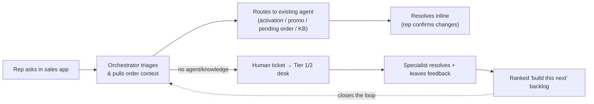

# Executive Summary — Rep Assist

## The problem

Retail reps regularly hit order and service problems they cannot solve
at the counter: a line stuck in **activation**, a **pending order** blocking a
new one, a **missing promotion**, a **billing** question, and a long tail of
miscellaneous issues. Today the rep's only options are to **open a ticket** or
**call a dedicated assist center**. Both are slow, pull the rep away from the
customer, and create queues that cost money and erode CSAT. The knowledge and
the automation to fix many of these issues already exist as standalone
agents — but reps have no single, conversational way to reach them.

## The solution

**Rep Assist** is a conversational **Assisted Sales & Service** assistant embedded
directly in the rep's sales workflow. The
rep types the problem in plain language; an **agentic orchestrator** (built on
LangGraph) understands it, pulls the order context, and routes to the right
**existing** resolver agent — Activation Resolver, Promo Correction Agent,
Pending Order Resolver, and the knowledge base. It resolves the issue inline,
**asking the rep to confirm** any change that touches the customer's account.

The experience is **generative-UI first**: rather than a blank text box, the chat
leads with **first-step CTAs** and rich, interactive cards a tap away — the rep's
**recent orders** and **open tickets**. These *agent-to-UI (A2UI)* elements are
served by a tool boundary (MCP) so the surface grows without rewrites. See
[A2UI — Agent-to-UI Elements](10-a2ui-generative-ui.md).

When nothing can resolve the issue automatically, Rep Assist **opens a
structured ticket** to a lightweight **Tier 1/2 Resolution Desk** that replaces
ServiceNow for this use case. Specialists fix the issue and leave **feedback**
that is aggregated into a **ranked backlog** telling the dev team exactly which
new agents/skills to build next. The assistant measurably improves over time.

## Why it matters (business value)

| Outcome | How Rep Assist drives it |
|---|---|
| **Lower assist-center volume & cost** | Deflect activation/promo/pending-order tickets to automated, inline resolution. |
| **Faster handle time / higher CSAT** | The rep stays with the customer; many issues resolve in seconds, not a callback. |
| **Safer changes** | Every account-mutating action is gated behind explicit rep confirmation (auditable). |
| **A system that improves itself** | Tier 1/2 feedback becomes a prioritized, data-driven dev backlog — investment goes where reps actually get stuck. |
| **Lower platform cost** | Replaces a ServiceNow workflow with a purpose-built, far cheaper desk for this lane. |

## How it works (one paragraph)

A **LangGraph** state machine orchestrates the conversation. A **triage** step
(Claude, with an offline fallback) classifies intent and extracts the order/
account ids; a **router** sends the request to the matching existing agent over
HTTP; resolvers that propose an account change pause the graph with a **human-
in-the-loop interrupt** so the rep approves it; unresolved issues fall through
to a **ticket** with the full conversation, order context, and the assistant's
trace attached. The **Resolution Desk** lets Tier 1/2 specialists resolve and
tag each ticket with a *recommended capability* and *gap type*, which the
**Insights** view ranks into a backlog for the dev team.

## Rollout in three phases

1. **Pilot (read-only + escalation).** Triage, KB answers, order-context lookup,
   and ticketing only — no automated account changes. Proves routing accuracy
   and deflection with zero write risk.
2. **Assisted resolution.** Turn on the existing resolver agents with mandatory
   rep confirmation for every write. Measure auto-resolution rate and reversal
   rate.
3. **Continuous improvement at scale.** Feed the capability backlog into the
   agent-development roadmap; expand intents; add analytics on deflection,
   handle time, and CSAT.

## Key risks & mitigations

| Risk | Mitigation |
|---|---|
| Wrong automated change to an account | Human-in-the-loop confirmation on every write; full audit trail; phased rollout. |
| Misrouting / hallucinated answers | Confidence threshold escalates uncertain cases to humans; KB answers are retrieved, not generated; structured outputs for triage. |
| LLM availability / latency | Deterministic rule-based fallback keeps the assistant functional if the model is unavailable. |
| PII / compliance | Order context is fetched on demand, not stored in prompts; see [Security](01-solution-architecture.md#security--compliance). |

## What exists today vs. what's left

This repository is a **working reference implementation** of the entire flow that
runs locally *and* deploys to the cloud as one service. It includes:

- the **LangGraph orchestrator** (triage → route → resolve → confirm → compose);
- the **rep chat** with **A2UI** recent-orders cards and a confirm/deny gate;
- the **Tier 1/2 Resolution Desk** (ServiceNow replacement) + feedback loop;
- a **Performance** dashboard (KPIs + AI-written executive summary) and a **CX
  Monitor** (latency/token/cost via LangSmith);
- a store **front-desk queue** and a read-only **Live Listen** copilot that
  suggests issues over the live conversation, scores each visit against a
  **Playbook**, coaches the rep, and drafts a customer summary email
  ([doc 19](19-store-checkin-queue.md), [doc 20](20-live-listen.md));
- **Training & Enablement** — auto-generated rep walkthroughs and an AI
  storyboard/training-video pipeline ([doc 21](21-training-and-enablement.md));
- **email reports** with subscriber management, and a responsive UI;
- **one-command deployment** to Google Cloud Run (Secret Manager, [doc 12](12-deployment-cloud-run.md)).

The remaining work to reach a pilot — real agent endpoints, SSO, audit logging,
production persistence, and hardening — is enumerated in
[Roadmap & What You Need To Do](06-roadmap-and-what-you-need-to-do.md).
