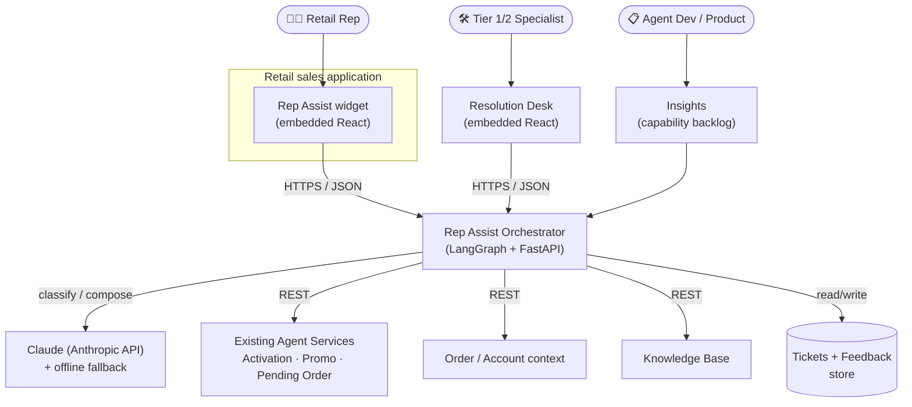
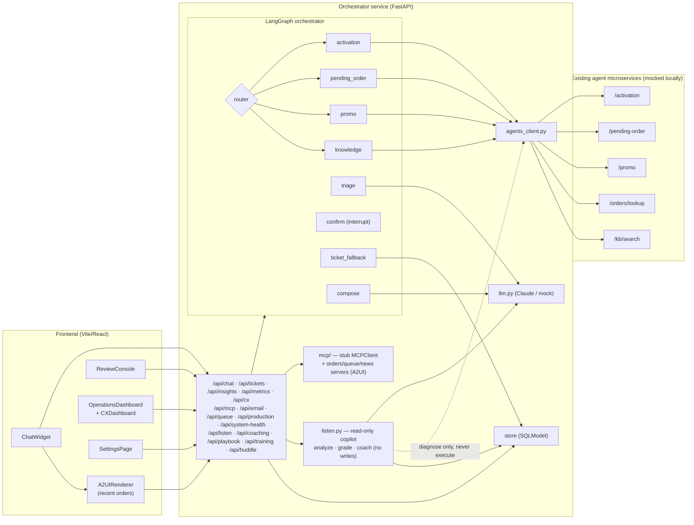
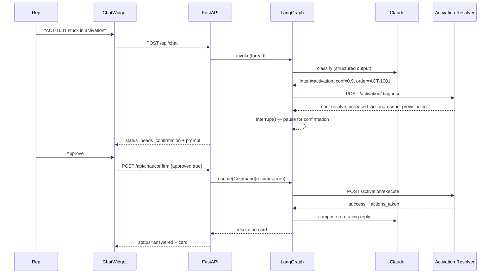
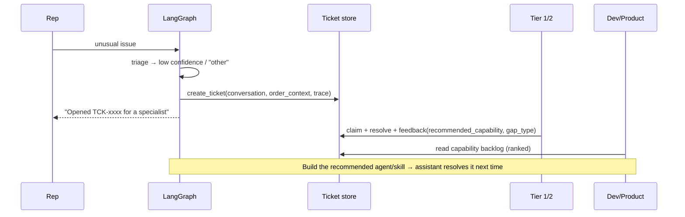
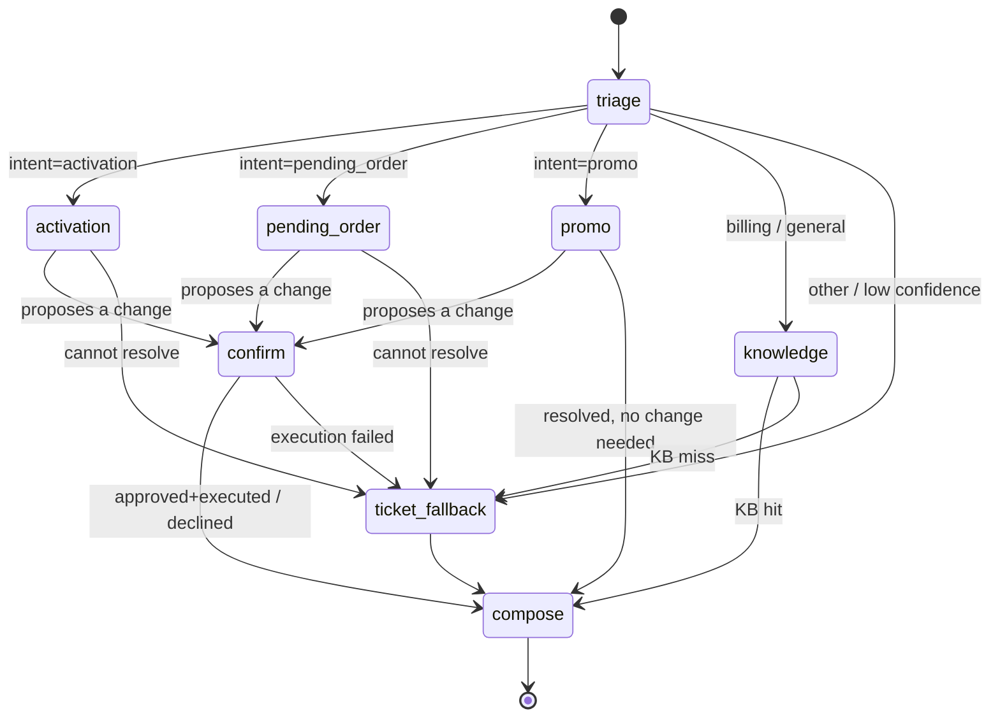
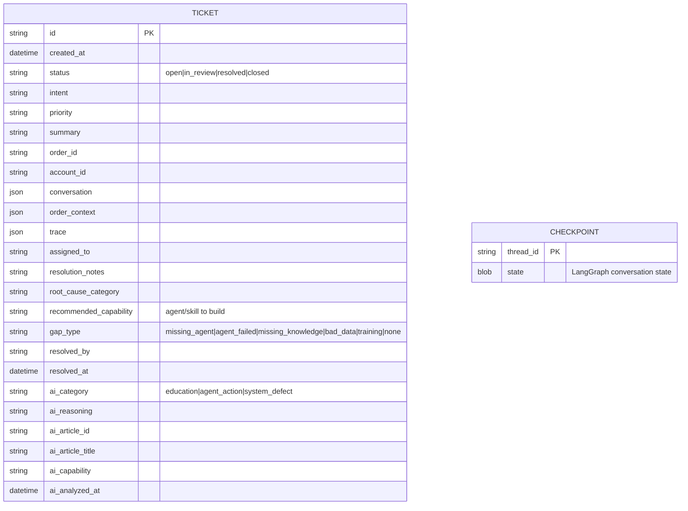

# Solution Architecture

## 1. System context

Rep Assist sits inside the retail sales application and brokers between the rep
and the existing fleet of resolver agents, the knowledge base, order systems, and
the human Resolution Desk.

**Trust boundaries.** The rep and Tier 1/2 UIs are authenticated retail surfaces.
The orchestrator is the only component that talks to the agent services, the
LLM, and the store; nothing in the browser holds credentials for those systems.

## 2. Container / component view

> **Live Listen is read-only.** The `listen` router calls the LLM (analyze /
> grade / coach) and, at most, an agent **diagnose** — it never routes through
> the graph and never executes a write. Accepting a suggestion re-enters the
> normal `Chat → /api/chat → LangGraph` path above, so every account change
> still passes the `confirm` gate. See [Live Listen](20-live-listen.md).

| Component | Responsibility | Code |
|---|---|---|
| `ChatWidget` | Rep conversation, resolution cards, confirm/deny | [`frontend/src/components/ChatWidget.tsx`](../frontend/src/components/ChatWidget.tsx) |
| `A2UIRenderer` | Generative-UI elements in chat (recent orders, open tickets, queue, live suggestions, coaching, enhancements, huddle); `type`→component registry | [`frontend/src/components/A2UI.tsx`](../frontend/src/components/A2UI.tsx) |
| `ReviewConsole` | Tier 1/2 ticket queue, detail, resolve + feedback, plus AI-assisted triage (Analyze → education/agent_action/system_defect one-click resolution) | [`frontend/src/components/ReviewConsole.tsx`](../frontend/src/components/ReviewConsole.tsx) |
| `OperationsDashboard` / `CXDashboard` | Performance KPIs + AI summary; LangSmith CX telemetry | [`frontend/src/components/`](../frontend/src/components) |
| `SettingsPage` / `SendReportButton` | Email-report subscribers + on-demand send/preview | [`frontend/src/components/`](../frontend/src/components) |
| API routers | HTTP surface (`chat, tickets, insights, metrics, cx, mcp, email, admin, queue, listen, coaching, playbook, training, huddle, production, system_health`) | [`backend/app/api/`](../backend/app/api) |
| Orchestrator graph | Triage → route → resolve → confirm → compose | [`backend/app/graph/`](../backend/app/graph) |
| **Live Listen** (read-only copilot) | Analyze a live transcript for triageable issues, grade the visit vs. the Playbook, generate coaching — no graph, no writes | [`listen.py`](../backend/app/api/listen.py), [`coaching.py`](../backend/app/api/coaching.py), [`playbook.py`](../backend/app/api/playbook.py) · [doc 20](20-live-listen.md) |
| **Training & Enablement** | Unified "Show me how" (generated steps + committed demo GIF + uploaded video), AI storyboard generator, training-video upload | [`training.py`](../backend/app/api/training.py) · [doc 21](21-training-and-enablement.md) |
| **MCP layer (stub)** | Agent-to-UI tool boundary; `orders` / `queue` / `news` / `ost` / `system` servers return A2UI elements | [`backend/app/mcp/`](../backend/app/mcp) |
| LLM | Triage + reply composition, live-transcript analysis, Playbook grading, coaching, summaries, storyboards (all structured-output, offline-safe) | [`backend/app/llm.py`](../backend/app/llm.py) |
| Agent adapter | HTTP client for existing agents (`diagnose` / `execute`) | [`backend/app/integrations/agents_client.py`](../backend/app/integrations/agents_client.py) |
| Store | Tickets + feedback + analytics + email subscribers + queue/listen/playbook/huddle | [`backend/app/store/`](../backend/app/store) |

## 3. Primary sequence — automated resolution with confirmation

## 4. Escalation sequence — no agent/knowledge can resolve

## 5. State machine

## 6. Data model

Two stores: the **ticket/feedback** database (SQLModel/SQLite locally; swap for
Postgres in production) and the **LangGraph checkpointer** (SQLite) that persists
per-conversation state so a paused confirmation can resume on the next request.

`TICKET` is the central entity above; the same SQLModel database also holds the
operational tables that back the dashboards and the newer surfaces. Each is
documented in full by its feature doc:

| Table | Purpose | Doc |
|---|---|---|
| `engagements` | One row per assistant turn/confirmation — the KPI source | [08](08-operations-dashboard.md) |
| `llm_calls` | Per-call token taxonomy + cost + fallback (true token economics) | [16](16-observability.md) |
| `guardrail_events` | Prompt-injection pattern matches (log-only, direct/indirect) | [16](16-observability.md) |
| `email_subscribers` | Report + alert + **visit-summary** recipients | [11](11-email-reports.md) |
| `production_issues`, `jira_defects` | AI-clustered systemic issues + stubbed JIRA board | [14](14-production-monitoring.md) |
| `queue_entries` | Store front-desk check-in / queue | [19](19-store-checkin-queue.md) |
| `listen_sessions` | Live Listen transcript, suggestions, summary, Playbook grade, coaching | [20](20-live-listen.md) |
| `playbook_guidelines` | The standard a Live Listen visit is graded against | [20](20-live-listen.md) |
| `enhancement_videos` | Uploaded training-video metadata (file on disk) | [21](21-training-and-enablement.md) |
| `huddle_items` | *The Opener* morning-huddle field-news items (served by the `news` MCP stub) | [10](10-a2ui-generative-ui.md) |
| `action_audit` | One row per executed mutating action — proof of the confirm-gate invariant | [16](16-observability.md) |

## 7. Key architectural decisions

| Decision | Rationale |
|---|---|
| **LangGraph** for orchestration | Native conditional routing + durable **interrupt/resume** for human-in-the-loop, with a checkpointer for per-conversation state. |
| **Existing agents over REST** | Mirrors the real distributed system; the orchestrator depends only on HTTP contracts, so pointing at production agents is a config change (`AGENT_SERVICES_BASE_URL`). |
| **Official `anthropic` SDK**, model `claude-opus-4-8` | Most capable default; triage uses **structured outputs** (`messages.parse`) for reliable intent JSON. Configurable to Sonnet/Haiku for cost. |
| **Deterministic offline fallback** | The assistant degrades gracefully (rule-based triage + templated replies) if the LLM is unavailable or unconfigured — no hard dependency for demos or outages. |
| **Confirmation gate on writes** | Account-mutating actions require explicit rep approval — safety + auditability. |
| **Feedback-as-backlog** | Tier 1/2 resolution captures *why* automation failed and *what to build*, turning support toil into a prioritized dev signal. |
| **AI-assisted triage, human-triggered action** | The Resolution Desk's classifier buckets tickets and proposes a resolution, but every action is still a rep-initiated click (or an override) — the same confirmation-gate philosophy as the live chat: AI narrows the work, a human still triggers the write. |
| **Read-only Live Listen copilot** | The live-conversation watcher only observes, suggests, and at most *diagnoses* — it never routes through the graph or executes. Accepting a suggestion re-enters the normal confirm-gated chat, so the copilot adds no new write path or audit surface. See [Live Listen](20-live-listen.md). |
| **A2UI over an MCP boundary** | Tools return structured UI element specs (not prose); the chat renders them via a `type`→component registry. The stub `MCPClient` has a real `tools/call` shape, so a production MCP order service drops in without touching the API or UI. See [A2UI](10-a2ui-generative-ui.md). |
| **One Cloud Run service (API + built UI)** | FastAPI serves the Vite bundle behind a SPA catch-all — one URL, no CORS, secrets in Secret Manager. See [Deployment](12-deployment-cloud-run.md). |

## 8. Security & compliance (prototype → production)

- **AuthN/Z.** Production: front both UIs with retail SSO; the orchestrator validates
  the rep/agent identity and role (rep vs. Tier 1/2) on every call. The prototype
  uses a stub `rep_id`.
- **Least privilege.** Only the orchestrator holds credentials for the agent
  services, the LLM, and the store. The browser never does.
- **PII handling.** Order/account context is fetched **on demand** for the active
  request and is not embedded in long-lived prompts. For production, scrub or
  tokenize PII before it reaches the model, and disable model-side retention.
- **Auditability.** Every automated change passes through `confirm` and is logged
  with the rep id, the action, params, and outcome. Tickets retain the full
  conversation + trace.
- **Data residency / model hosting.** Claude is available via the first-party
  API, AWS (Claude Platform on AWS / Bedrock), Vertex, and Foundry — choose the
  deployment that satisfies the retailer's data-residency posture without changing
  the orchestration code.

## 9. Scalability & reliability

- **Stateless orchestrator + external checkpointer.** Run N replicas behind a load
  balancer; conversation state lives in the checkpoint store (swap SQLite →
  Postgres/Redis), so any replica can resume any thread.
- **Timeouts + graceful degradation.** Every agent call is time-bounded; a failed
  agent call degrades to a ticket rather than an error.
- **Idempotent writes.** Production resolver `execute` calls should be idempotent
  (keyed by thread/action id) so a retried confirmation cannot double-apply.
