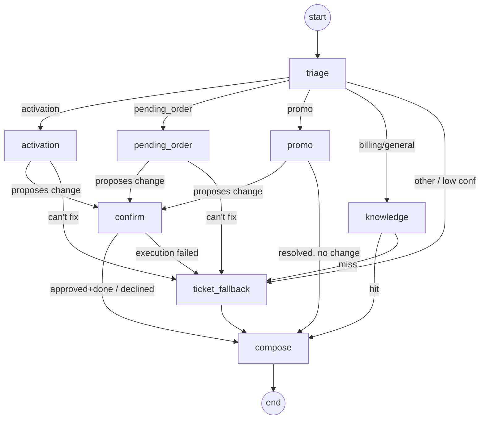

# LangGraph Orchestration

The orchestrator is a LangGraph `StateGraph` compiled with a SQLite
checkpointer. It is the brain of Rep Assist: it triages the request, routes to
the right existing agent, runs a human-in-the-loop confirmation for any account
change, falls back to a ticket when nothing fits, and composes the rep-facing
reply.

Code: [`backend/app/graph/`](../backend/app/graph) — `state.py`, `nodes.py`,
`orchestrator.py`.

> **What runs *outside* the graph — by design.** Only the rep's problem-solving
> chat goes through this StateGraph. Fixed-shape or read-only surfaces
> deliberately do not: front-desk **check-in** is an intake form
> ([doc 19](19-store-checkin-queue.md)), and **Live Listen** is a read-only
> copilot that analyzes/grades/coaches without ever routing here or executing a
> write ([doc 20](20-live-listen.md)). Both re-enter this graph the moment a rep
> **Accepts** — the single confirm-gated write path stays in one place.

## Why LangGraph

- **Conditional routing** as first-class edges (triage → the right resolver).
- **Durable interrupts** (`interrupt()` / `Command(resume=...)`) for true
  human-in-the-loop: the graph pauses mid-run waiting for the rep to approve a
  change, then resumes exactly where it left off.
- **Checkpointer** persists per-conversation state keyed by `thread_id`, so a
  paused confirmation survives across separate HTTP requests (and replicas).

## The graph



## State

`GraphState` ([`state.py`](../backend/app/graph/state.py)) is a `TypedDict` with
reducers. Messages and the observability trace use `operator.add` so each node
**appends** rather than overwrites:

```python
class GraphState(TypedDict, total=False):
    messages: Annotated[list[dict], operator.add]   # {"role","content","card"?}
    intent: Optional[str]
    confidence: Optional[float]
    entities: dict                                  # order_id / account_id / mtn
    order_context: Optional[dict]
    route: Optional[str]                            # set by nodes, read by edges
    proposed_action: Optional[dict]                 # mutating fix awaiting approval
    resolution: Optional[dict]                      # final Resolution
    ticket_id: Optional[str]
    trace: Annotated[list[dict], operator.add]      # per-node breadcrumbs
```

## Nodes

| Node | What it does | Calls |
|---|---|---|
| `triage` | Classify intent + confidence, extract ids, fetch order context | `llm.classify`, `agents_client.order_context` |
| `activation` / `pending_order` / `promo` | Ask the matching existing agent to diagnose; set a proposed action, resolve, or mark unresolved | `agents_client.diagnose` |
| `knowledge` | KB lookup for billing/general | `agents_client.kb_search` |
| `confirm` | **`interrupt()`** for rep approval; on approve, execute the change | `agents_client.execute` |
| `ticket_fallback` | Create a human ticket with full context | `store.db.create_ticket` |
| `compose` | Build the rep-facing reply + a structured UI card | `llm.compose_reply` |

Routing uses two edge functions: `route_after_triage` (intent + a confidence
threshold) and `route_by_state` (follow the `route` a node set). Low confidence
or `other` short-circuits straight to `ticket_fallback`.

## The human-in-the-loop interrupt

This is the core safety mechanism. A resolver that wants to change the account
returns a `proposed_action` and routes to `confirm`, which pauses the graph:

```python
def confirm(state):
    action = state["proposed_action"]
    decision = interrupt({                 # <-- graph pauses here
        "type": "confirm_action",
        "prompt": action["human_prompt"],
        "action": action,
    })
    if not approved(decision):
        return {"route": "compose", "resolution": cancelled(...)}
    result = agents_client.execute(ProposedAction(**action))   # runs only after resume
    return {"route": "compose", "resolution": resolved(result)}
```

The API surfaces and resumes it:

```python
# first request hits the interrupt
graph.invoke({"messages":[user_msg]}, {"configurable": {"thread_id": tid}})
snapshot = graph.get_state(cfg)            # snapshot.tasks[*].interrupts → prompt

# later, after the rep clicks Approve/Decline
graph.invoke(Command(resume=approved), cfg)
```

Because the checkpointer persists state by `thread_id`, the two requests can hit
different orchestrator replicas and the conversation still resumes correctly.
See [`orchestrator.py`](../backend/app/graph/orchestrator.py)
(`start_or_continue` / `resume`).

## Triage with structured output (and offline fallback)

[`llm.py`](../backend/app/llm.py) uses the official `anthropic` SDK. Triage asks
Claude for a **structured** `TriageResult` via `messages.parse`, which guarantees
parseable intent JSON:

```python
resp = client.messages.parse(
    model=settings.anthropic_model,        # default claude-opus-4-8
    system=TRIAGE_SYSTEM,
    messages=[{"role": "user", "content": text}],
    output_format=TriageResult,            # pydantic: intent, confidence, ids, summary
)
```

If no `ANTHROPIC_API_KEY` is set — or any live call fails — `classify()` and
`compose_reply()` fall back to a deterministic, rule-based implementation, so the
graph always returns a sensible result. This is what lets the whole stack run
offline for demos and stay up during an LLM outage.

## Adding a new agent/skill (the extension point)

1. **Expose the agent** at `/{capability}/diagnose` and `/{capability}/execute`
   (or point `agents_client` at its real endpoint).
2. **Map the intent → capability** in `agents_client.CAPABILITY_PATHS` and
   `schemas.INTENT_TO_CAPABILITY`.
3. **Add a node** (or reuse `_run_resolver`) and a routing branch in
   `orchestrator._build()`.
4. **Teach triage** the new intent (system prompt + the mock fallback keywords).

The capability backlog (see [feedback doc](04-feedback-and-continuous-improvement.md))
tells you *which* agent to add first. For a fully worked, tested example of
pointing one intent at a **real, vendor-shaped** agent (with its own contract +
auth), see [Real Agent Integration](07-real-agent-integration-example.md).

## Tests

[`backend/tests/test_graph.py`](../backend/tests/test_graph.py) runs the whole
graph offline (mock LLM + stubbed agents) and asserts the confirm/resolve,
decline, KB-hit, and escalation paths. `backend/scripts/smoke.py` drives the
same flows against the live HTTP stack.
