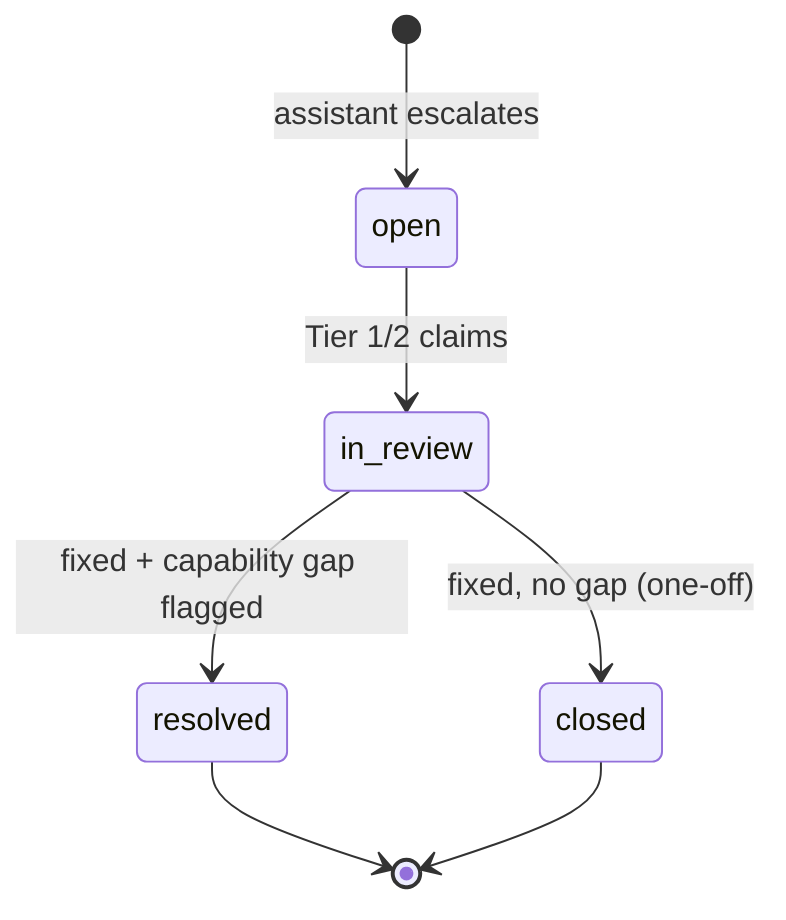

# Human-in-the-Loop Ticketing (ServiceNow Replacement)

When the assistant cannot resolve an issue — no agent fits, an agent can't fix
it, the KB has no answer, or triage confidence is too low — it opens a ticket to
a lightweight **Resolution Desk** where Tier 1/2 specialists work it offline.
This replaces the ServiceNow workflow for this support lane with a purpose-built,
far cheaper desk that also **feeds the assistant's improvement loop**. An
**AI Assisted Resolution Desk** pass (see [below](#ai-assisted-resolution-desk))
now does the first read of the backlog for the specialist — bucketing tickets
and proposing a one-click resolution — while the original manual resolve form
remains the fallback/override for any ticket.

Code: store [`backend/app/store/`](../backend/app/store), API
[`backend/app/api/tickets.py`](../backend/app/api/tickets.py), UI
[`frontend/src/components/ReviewConsole.tsx`](../frontend/src/components/ReviewConsole.tsx).

## Ticket lifecycle

| Status | Meaning |
|---|---|
| `open` | Created by the assistant, unassigned. |
| `in_review` | Claimed by a Tier 1/2 agent. |
| `resolved` | Fixed **and** a capability gap was recorded (feeds the backlog). |
| `closed` | Fixed, but nothing to build (true one-off). |

## What every ticket captures (automatically)

Because the assistant created it, the ticket arrives **pre-loaded** with
everything a specialist needs — no back-and-forth to reconstruct context:

- The **full conversation** transcript (rep + assistant turns).
- The **order/account context** the orchestrator fetched.
- The assistant's **trace** — which nodes ran and what each decided ("what the
  assistant tried").
- **Intent, priority, and a suggested capability** (a starting hypothesis for the
  specialist).

This is the single biggest win over a blank ServiceNow form: the specialist
opens the ticket already knowing the order, the customer's words, and exactly
where automation stopped.

## The Resolution Desk (UI)

A two-pane console:

- **Left — queue.** Filter by status (`open` / `in_review` / `resolved` / `all`),
  see id, priority, intent, and summary at a glance.
- **Right — detail + resolve.** Conversation transcript, order context (raw JSON),
  the assistant's trace, and a **resolve form**:
  - *Resolution notes* — what you did for the customer.
  - *Root cause* — the underlying cause.
  - *Recommended agent/skill* — what the dev team should build/fix so the
    assistant handles this next time.
  - *Gap type* — the structured reason automation failed (drives prioritization).
  - **Resolve & flag capability gap** or **Close (no gap)**.

## AI Assisted Resolution Desk

Working an open/`in_review` backlog ticket-by-ticket doesn't scale once volume
grows, and a lot of it doesn't need Tier 1/2 judgment at all — a classifier
can tell "this is a how-to answer" from "this needs a dev" from "our
activation resolver can just do this" faster than a human scanning
summaries. The **Analyze** button on the queue (enabled when the status
filter is `open` or `in_review`) runs an AI pass over the current backlog and
buckets every ticket into one of three categories, each with a one-click
resolution action. The pre-existing manual **Resolve & flag capability gap**
/ **Close (no gap)** form is unchanged and still works as a fallback or
override for any ticket, AI-bucketed or not.

Code: classifier [`backend/app/llm.py`](../backend/app/llm.py)
(`classify_resolution_tickets`), endpoints
[`backend/app/api/tickets.py`](../backend/app/api/tickets.py), UI
[`frontend/src/components/ReviewConsole.tsx`](../frontend/src/components/ReviewConsole.tsx).

### The three buckets

| `ai_category` | Meaning | One-click action |
|---|---|---|
| `education` | The customer needs an explanation/how-to answer. | **Share article & resolve** — a real **OST** knowledge-base article looked up live via the `ost` MCP stub's `search_articles` tool (not an LLM guess); the rep can override the AI's pick with a manual article search. Resolves with `gap_type=none`, status `closed` (nothing for the dev team to build). |
| `agent_action` | An existing automated resolver can likely fix it. | **Call agent & resolve** — runs the same `diagnose` → `execute` flow the live chat's resolver nodes use ([doc 02](02-langgraph-orchestration.md)). On success it resolves with `gap_type=none`, status `closed`. On failure it returns the diagnosis and leaves the ticket untouched, so the rep falls back to the manual resolve form. |
| `system_defect` | Something is actually broken and needs the dev team. | **Attach or file a defect & resolve** — attach to a matching open JIRA-stub defect, or file a new one, then resolve with status `resolved` (a real capability gap — flows into the [capability-gaps backlog](04-feedback-and-continuous-improvement.md)). |

`agent_action` is restricted — by prompt instruction *and* a backend guardrail
(`ALLOWED_AGENT_INTENTS` in `api/tickets.py`) — to the four intents that have
a real automated resolver behind
[`agents_client.py`](../backend/app/integrations/agents_client.py):
`activation`, `pending_order`, `promo`, `occ`. A ticket in any other intent
can never be bucketed `agent_action`, regardless of what the model returns.

### Running an analysis pass

`POST /api/tickets/analyze {"status": "open" | "in_review"}` runs
`llm.classify_resolution_tickets()` — a Claude call with a **structured
output** schema (`TicketClassificationBatch`), the same offline-safe pattern
as `analyze_production_issues` ([doc 14](14-production-monitoring.md)): with
no `ANTHROPIC_API_KEY`, or on a failed live call, it falls back to a
deterministic intent-based rule set so the desk still works offline. For
each ticket the endpoint additionally:

- looks up a real OST article for `education` tickets (`ost.search_articles`);
- resolves a capability name for `agent_action` tickets (`schemas.INTENT_TO_CAPABILITY`);

and persists `ai_category`, `ai_reasoning`, `ai_article_id` /
`ai_article_title` (education), `ai_capability` (agent_action), and
`ai_analyzed_at` on the ticket. The queue shows a small AI-category badge per
ticket and a 3-tile bucket-count summary above it; the ticket detail view
gains an **AI suggested resolution** panel matching its bucket.

### System_defect: attach vs. file new

`GET /api/tickets/{id}/candidate-defects` returns open JIRA-stub defects that
share the ticket's intent as a label, so the rep can attach a duplicate-
looking ticket to an existing defect instead of filing a new one.
`JiraDefect.ticket_ids` ([doc 14](14-production-monitoring.md)) is a list,
not a single value, precisely so one defect can accumulate every Resolution
Desk ticket that turned out to be the same underlying bug.

## API

| Method | Path | Purpose |
|---|---|---|
| `GET` | `/api/tickets?status=` | Queue (optionally filtered) |
| `GET` | `/api/tickets/{id}` | Full ticket |
| `POST` | `/api/tickets/{id}/claim` | `{agent}` → `in_review` |
| `POST` | `/api/tickets/{id}/resolve` | `{resolution_notes, root_cause_category, recommended_capability, gap_type, resolved_by, close_only}` |
| `POST` | `/api/tickets/analyze` | `{status: "open" \| "in_review"}` → runs the AI classifier over that backlog, persists `ai_*` fields, returns bucket counts + updated tickets |
| `POST` | `/api/tickets/{id}/resolve-education` | `{article_id, resolved_by, notes?}` → shares the OST article, resolves `gap_type=none`, status `closed` |
| `POST` | `/api/tickets/{id}/call-agent` | `{resolved_by}` → runs `diagnose`→`execute` for the ticket's order/account id; resolves on success, returns the diagnosis untouched on failure |
| `GET` | `/api/tickets/{id}/candidate-defects` | Open JIRA-stub defects sharing the ticket's intent as a label |
| `POST` | `/api/tickets/{id}/file-defect` | `{resolved_by, gap_type, attach_to?, recommended_capability?}` → files a new defect or attaches to `attach_to`, resolves with `status=resolved` |

## Why not ServiceNow

| | ServiceNow (today) | Rep Assist Resolution Desk |
|---|---|---|
| Context capture | Rep retypes the problem; specialist re-investigates | Auto-attached conversation + order + assistant trace |
| Purpose | Generic ITSM, heavyweight, licensed per-seat | Purpose-built for this support lane |
| Improvement loop | Tickets close into a black hole | Every resolution emits a structured "build this" signal |
| Cost | Platform + license cost | Runs on the same lightweight service as the orchestrator |
| Integration | Separate system the rep context-switches to | Same app surface, same data model as the assistant |

> **Scope note.** This replaces ServiceNow **for the rep order/service-assist
> lane** described here. It is not a general ITSM replacement. If the business needs
> SLAs, escalation chains, or external-team routing, either extend this schema
> (add `sla_due`, `queue`, `escalation_tier`) or bridge selected tickets back to
> the enterprise ITSM via a connector — see the
> [roadmap](06-roadmap-and-what-you-need-to-do.md).

## Continuity

The exact same `recommended_capability` + `gap_type` a specialist enters here is
what powers the [continuous-improvement backlog](04-feedback-and-continuous-improvement.md).
Resolving a ticket *is* the act of teaching the system what to build next.

The AI Assisted Resolution Desk's one-click actions write through this same
path: `resolve-education` and `call-agent` resolve with `gap_type=none`
(status `closed` — nothing for the dev team to build), while `file-defect`
resolves with a real `gap_type` + `recommended_capability` (status
`resolved`) — so a ticket a rep resolved with one click scores into the
capability backlog exactly like one resolved through the manual form.
