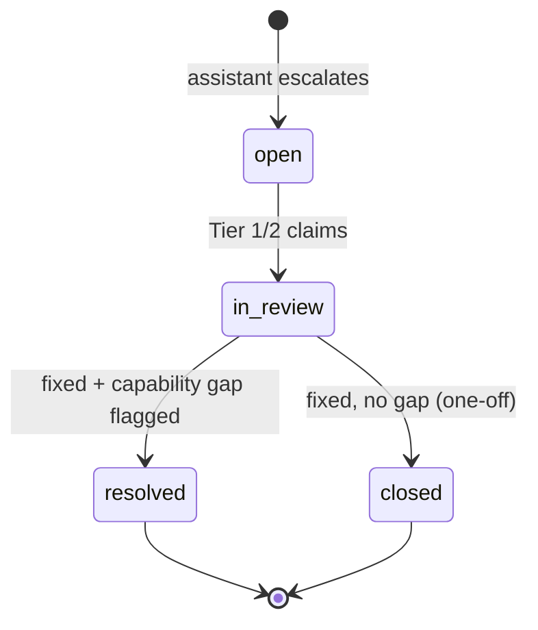

# Human-in-the-Loop Ticketing (ServiceNow Replacement)

When the assistant cannot resolve an issue — no agent fits, an agent can't fix
it, the KB has no answer, or triage confidence is too low — it opens a ticket to
a lightweight **Resolution Desk** where Tier 1/2 specialists work it offline.
This replaces the ServiceNow workflow for this support lane with a purpose-built,
far cheaper desk that also **feeds the assistant's improvement loop**.

Code: store [`backend/app/store/`](../backend/app/store), API
[`backend/app/api/tickets.py`](../backend/app/api/tickets.py), UI
[`frontend/src/components/ReviewConsole.tsx`](../frontend/src/components/ReviewConsole.tsx).

## Ticket lifecycle

| Status | Meaning |
|---|---|
| `open` | Created by the assistant, unassigned. |
| `in_review` | Claimed by a Tier 1/2 agent. |
| `resolved` | Fixed **and** a capability gap was recorded (feeds the backlog). |
| `closed` | Fixed, but nothing to build (true one-off). |

## What every ticket captures (automatically)

Because the assistant created it, the ticket arrives **pre-loaded** with
everything a specialist needs — no back-and-forth to reconstruct context:

- The **full conversation** transcript (rep + assistant turns).
- The **order/account context** the orchestrator fetched.
- The assistant's **trace** — which nodes ran and what each decided ("what the
  assistant tried").
- **Intent, priority, and a suggested capability** (a starting hypothesis for the
  specialist).

This is the single biggest win over a blank ServiceNow form: the specialist
opens the ticket already knowing the order, the customer's words, and exactly
where automation stopped.

## The Resolution Desk (UI)

A two-pane console:

- **Left — queue.** Filter by status (`open` / `in_review` / `resolved` / `all`),
  see id, priority, intent, and summary at a glance.
- **Right — detail + resolve.** Conversation transcript, order context (raw JSON),
  the assistant's trace, and a **resolve form**:
  - *Resolution notes* — what you did for the customer.
  - *Root cause* — the underlying cause.
  - *Recommended agent/skill* — what the dev team should build/fix so the
    assistant handles this next time.
  - *Gap type* — the structured reason automation failed (drives prioritization).
  - **Resolve & flag capability gap** or **Close (no gap)**.

## API

| Method | Path | Purpose |
|---|---|---|
| `GET` | `/api/tickets?status=` | Queue (optionally filtered) |
| `GET` | `/api/tickets/{id}` | Full ticket |
| `POST` | `/api/tickets/{id}/claim` | `{agent}` → `in_review` |
| `POST` | `/api/tickets/{id}/resolve` | `{resolution_notes, root_cause_category, recommended_capability, gap_type, resolved_by, close_only}` |

## Why not ServiceNow

| | ServiceNow (today) | Rep Assist Resolution Desk |
|---|---|---|
| Context capture | Rep retypes the problem; specialist re-investigates | Auto-attached conversation + order + assistant trace |
| Purpose | Generic ITSM, heavyweight, licensed per-seat | Purpose-built for this support lane |
| Improvement loop | Tickets close into a black hole | Every resolution emits a structured "build this" signal |
| Cost | Platform + license cost | Runs on the same lightweight service as the orchestrator |
| Integration | Separate system the rep context-switches to | Same app surface, same data model as the assistant |

> **Scope note.** This replaces ServiceNow **for the rep order/service-assist
> lane** described here. It is not a general ITSM replacement. If Verizon needs
> SLAs, escalation chains, or external-team routing, either extend this schema
> (add `sla_due`, `queue`, `escalation_tier`) or bridge selected tickets back to
> the enterprise ITSM via a connector — see the
> [roadmap](06-roadmap-and-what-you-need-to-do.md).

## Continuity

The exact same `recommended_capability` + `gap_type` a specialist enters here is
what powers the [continuous-improvement backlog](04-feedback-and-continuous-improvement.md).
Resolving a ticket *is* the act of teaching the system what to build next.
