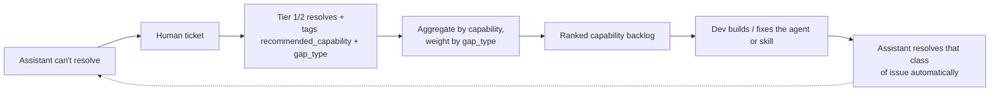

# Feedback & Continuous Improvement

The defining feature of Rep Assist is that **it gets better on purpose**. Every
ticket a Tier 1/2 specialist resolves carries structured feedback that is
aggregated into a **ranked backlog of agents/skills** for the dev team. The
assistant doesn't silently fail — each miss becomes a prioritized,
evidence-backed recommendation.

Code: aggregation in
[`backend/app/store/db.py`](../backend/app/store/db.py) (`capability_gaps`),
API [`backend/app/api/insights.py`](../backend/app/api/insights.py), UI
[`frontend/src/components/InsightsPanel.tsx`](../frontend/src/components/InsightsPanel.tsx).

## The loop



## The two feedback fields that matter

When resolving a ticket, the specialist records:

1. **`recommended_capability`** — the agent or skill that *should* have handled
   this (e.g. `wearable-settings-agent`, `promo-correction-agent`). This is the
   unit the backlog ranks.
2. **`gap_type`** — *why* automation failed, which determines how urgently it's
   worth investing:

| `gap_type` | Meaning | Weight |
|---|---|---|
| `missing_agent` | No automation exists for this problem | 3 |
| `agent_failed` | An agent exists but returned wrong/no result | 3 |
| `missing_knowledge` | KB has no article | 2 |
| `bad_data` | Upstream/system data issue (not an agent gap) | 1 |
| `training` | Rep education, not a software gap | 1 |
| `none` | True one-off; nothing to build | 0 |

## Scoring

`capability_gaps()` only counts tickets a human **actually resolved with a
confirmed gap** (`gap_type` set and not `none`) — auto-prefilled hints on open
tickets and "close (no gap)" outcomes are excluded, so the backlog is signal,
not noise. For each recommended capability it sums the gap-type weights into a
**priority score** and ranks descending:

```
priority(capability) = Σ weight(gap_type) over its resolved tickets
```

So three "missing agent" tickets (3+3+3 = 9) outrank five "training" tickets
(5×1 = 5): the list reflects *resolvable automation value*, not raw volume.

## AI-classified tickets feed the identical backlog

The [AI Assisted Resolution Desk](03-hitl-ticketing-workflow.md#ai-assisted-resolution-desk)'s
`system_defect` one-click action (`POST /api/tickets/{id}/file-defect`) calls
the same `resolve_ticket()` write path as the manual form — `status=resolved`,
a real `gap_type`, and a `recommended_capability` — so it scores into
`capability_gaps()` exactly like a ticket resolved through the original
feedback form; no separate aggregation logic was needed. The `education`
and `agent_action` one-click actions instead resolve with `gap_type=none`
(status `closed`), the same as picking "Close (no gap)" by hand, because
sharing an article or running an existing resolver isn't a capability gap.

## The Insights view

`GET /api/insights/capability-gaps` returns the ranked backlog; the **Insights**
tab renders it as a leaderboard. Each row shows the capability, its priority
score (as a bar), ticket count, the breakdown of gap types, and example tickets
so a PM can read the actual rep problems behind the number.

```json
{
  "gaps": [
    {
      "capability": "wearable-settings-agent",
      "ticket_count": 1,
      "score": 3,
      "gap_types": {"missing_agent": 1},
      "intents": {"general": 1},
      "examples": [{"ticket_id": "TCK-E541129C",
                    "summary": "Customer keeps getting spam scam-likely labels"}]
    }
  ]
}
```

## How the dev team consumes it

1. **Sprint planning.** The top of the backlog is the next agent/skill to build —
   each item already justified by real, costed rep tickets.
2. **Fix vs. build.** `agent_failed` rows point at *existing* agents to debug;
   `missing_agent` rows point at *new* automation; `missing_knowledge` rows point
   at KB authoring (cheap, high-leverage).
3. **Measure the close.** After shipping an agent, that capability's new-ticket
   rate should fall — a direct, observable ROI signal that the loop closed.

## Beyond the prototype

The same data supports richer analytics with no schema change: **deflection
rate** (auto-resolved ÷ total), **auto-resolution by intent**, **reversal rate**
(declined/rolled-back confirmations), **time-to-resolution** on the desk, and a
**trend** of capability scores over time. With a real LLM you can additionally
cluster free-text `resolution_notes` to discover *new* intents the taxonomy is
missing — see the [roadmap](06-roadmap-and-what-you-need-to-do.md).
