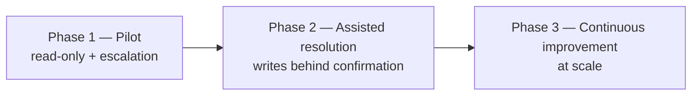

# Roadmap & What You Need To Do

This reference implementation proves the end-to-end flow. This page is the
**concrete plan to take it to a pilot and beyond** — organized as (A) what's
done, (B) a phased rollout, (C) workstream task lists, and (D) your immediate
next steps.

---

## A. What this prototype already gives you

- ✅ A working **LangGraph orchestrator**: triage → route → resolve → confirm →
  compose, with durable human-in-the-loop interrupts.
- ✅ **Rep chat UI** with resolution cards and a confirm/deny gate.
- ✅ **Tier 1/2 Resolution Desk** (ServiceNow replacement) with full context
  capture and a feedback form.
- ✅ **Capability backlog** analytics that rank what to build next.
- ✅ **Mocked existing-agent microservices** with realistic contracts.
- ✅ Offline mock LLM + live Claude (official SDK, structured-output triage).
- ✅ Tests + smoke driver.

Everything below is what's needed to make it real.

---

## B. Phased rollout

**Phase 1 — Pilot (no automated writes).** Triage, KB answers, order-context
lookup, and ticketing only. Goal: validate routing accuracy and ticket
deflection with **zero write risk**. Exit criteria: triage precision ≥ target,
specialists report tickets arrive "ready to work."

**Phase 2 — Assisted resolution.** Enable the real resolver agents with
**mandatory rep confirmation** on every account change. Goal: drive
auto-resolution rate up while keeping reversal rate near zero. Exit criteria:
auto-resolution ≥ target, reversal rate ≤ target, full audit coverage.

**Phase 3 — Continuous improvement at scale.** Feed the capability backlog into
the agent roadmap, expand intents, add deflection/CSAT analytics, and (optional)
selective auto-approval for the safest, highest-confidence actions.

---

## C. Workstreams & tasks

### 1. Integrate the real existing agents  *(highest priority)*
> Two fully worked, tested examples are already in the repo — the **Activation**
> (Bearer auth) and **Promo** (X-Api-Key) intents, each a vendor-shaped agent +
> adapter + contract test. Follow
> [Real Agent Integration](07-real-agent-integration-example.md) as the template;
> Pending Order is the next one to do.
- [ ] Get the real endpoints/contracts for **Activation Resolver**, **Pending
      Order Resolver**, **Promo Correction Agent**, the **order/account context**
      service, and the **knowledge base**.
- [ ] Map each to the `diagnose` / `execute` shape in
      [`agents_client.py`](../backend/app/integrations/agents_client.py) (or adjust
      the adapter to their native shape). Keep `diagnose` read-only and `execute`
      the only write.
- [ ] Set `AGENT_SERVICES_BASE_URL` (or per-agent URLs) and add auth headers/mTLS.
- [ ] Make `execute` **idempotent** (key by `thread_id`+action) so a retried
      confirmation can't double-apply.
- [ ] Update intent→capability maps in `agents_client.CAPABILITY_PATHS` and
      `schemas.INTENT_TO_CAPABILITY` as you add agents.

### 2. LLM & triage quality
- [ ] Provision Claude access for the chosen hosting (first-party API, **Claude
      Platform on AWS**, Bedrock, Vertex, or Foundry per data-residency).
- [ ] Decide model per route: `claude-opus-4-8` for hard reasoning,
      `claude-sonnet-4-6`/`haiku-4-5` for high-volume triage (set `ANTHROPIC_MODEL`).
- [ ] Build a **triage eval set** from real rep transcripts; tune the system
      prompt and the confidence threshold; track precision/recall per intent.
- [ ] Add prompt-caching for the (stable) triage system prompt to cut cost.

### 3. Security, identity & compliance
- [ ] Front both UIs and the API with **POS SSO**; pass the rep/agent identity and
      role to the orchestrator; enforce rep vs. Tier 1/2 authorization on every route.
- [ ] Add **audit logging** for every `execute` (who/what/params/outcome) to your
      SIEM; retain ticket conversation + trace per policy.
- [ ] **PII**: scrub/tokenize before prompts; disable model retention; document
      data flows for privacy review.
- [ ] Secrets in a vault (not `.env`); rotate; least-privilege per service.

### 4. Persistence & scale
- [ ] Swap SQLite → **Postgres** for tickets (`TICKETS_DB_URL`) and a durable
      checkpointer (Postgres/Redis) so any replica resumes any thread.
- [ ] Run the orchestrator stateless behind a load balancer (N replicas).
- [ ] Add migrations (Alembic) for the ticket schema.

### 5. Observability & ops
- [ ] Structured logs + **tracing** (OpenTelemetry) across triage→agent→confirm.
- [ ] Dashboards: deflection rate, auto-resolution by intent, reversal rate,
      time-to-resolution, capability-backlog trend.
- [ ] Alerting on agent timeouts/error spikes and LLM fallbacks.
- [ ] Health/readiness probes; graceful shutdown; rate limiting.

### 6. Frontend / POS embedding
- [ ] Embed `ChatWidget` in the POS shell (iframe or web component); pass the POS
      session/rep context in; theme to the POS design system.
- [ ] Point the API base at the real gateway (replace the Vite dev proxy).
- [ ] Optional: streaming responses (SSE) for a more responsive feel.
- [ ] Accessibility pass (WCAG) and localization.

### 7. Resolution Desk hardening
- [ ] Add SLA timers, queues/assignment rules, and notifications if needed.
- [ ] Decide the ServiceNow boundary: fully replace this lane, or **bridge**
      selected tickets to enterprise ITSM via a connector.
- [ ] Role-based views; per-ticket comments/history.

### 8. Continuous-improvement analytics
- [ ] Productionize `/api/insights/capability-gaps` into a PM dashboard.
- [ ] Add reversal-rate and deflection metrics.
- [ ] (LLM) Cluster free-text `resolution_notes` to discover **new intents** the
      taxonomy is missing, and feed them back into triage.

### 9. Testing & release
- [ ] Contract tests against each real agent; integration tests on the full graph.
- [ ] Load tests at expected POS concurrency.
- [ ] Canary + rollback plan; feature-flag each agent so you can enable/disable
      automation per intent independently.

---

## D. Your immediate next steps (in order)

1. **Run it.** Follow the [runbook](05-local-setup-runbook.md), click through all
   six demo scenarios, and confirm the flow matches your mental model.
2. **Add your Claude key** to `backend/.env` and re-run to see live triage; sanity-
   check classifications on a handful of real rep phrasings.
3. **Inventory the real agents.** For each existing agent, capture: base URL, auth,
   the "diagnose" call (read), the "fix" call (write), and its request/response
   shape. This unblocks workstream #1.
4. **Pick the hosting** for Claude (data-residency decision) and confirm model
   choice per route.
5. **Decide the ServiceNow boundary** for this lane (full replace vs. bridge) so
   the desk scope is fixed before pilot.
6. **Stand up Phase 1** (read-only + escalation) in a non-prod POS environment
   behind SSO, and start collecting triage-accuracy and deflection data.

> Tackle in this order: **#1 integrate agents → #3 security/SSO → #4 persistence →
> #5 observability**, then turn on writes (Phase 2). Everything else can land in
> parallel once those four are solid.
