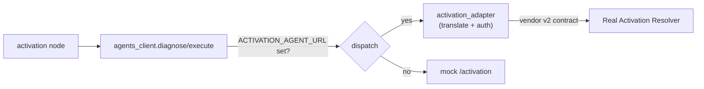

# Real Agent Integration — Worked Example (Activation Resolver)

This is the **template for integrating a real existing agent**. It's fully
implemented and tested in the repo for **two** intents — **Activation** (Bearer
token, an analyze/remediate contract) and **Promo** (`X-Api-Key`, an eligibility
contract) — which proves the pattern generalizes across agents with different
shapes and auth schemes. The same recipe applies to Pending Order and any future
agent.

> **Two integration styles.** This doc covers the **diagnose/execute adapter** —
> the right shape for a task agent that proposes a discrete, confirm-gated
> account change. For a **conversational** external agent that you relay whole
> turns to (and surface its reply), see
> [CES Agent Routing](23-ces-agent-routing.md), which hides a Google CES
> `runSession` relay behind the same "config toggle, not a rewrite" principle.

## The idea

The orchestrator only knows our **internal contract**
(`DiagnoseRequest`/`DiagnoseResponse`, `ProposedAction`, `ExecuteResponse`). Real
agents speak their own **vendor contract** and require auth. Integration = a thin
**adapter** that translates between the two and is selected by config — so
swapping mock → real is a toggle, not a rewrite.



## Files

| File | Role |
|---|---|
| [`integrations/activation_adapter.py`](../backend/app/integrations/activation_adapter.py) | Activation adapter: vendor models, **pure translation functions**, auth'd HTTP call |
| [`integrations/promo_adapter.py`](../backend/app/integrations/promo_adapter.py) | Promo adapter — same pattern, different contract + `X-Api-Key` auth |
| [`integrations/agents_client.py`](../backend/app/integrations/agents_client.py) | Dispatches `activation`/`promo` to their adapter when `*_AGENT_URL` is set |
| [`sample_agent/main.py`](../backend/app/sample_agent/main.py) | Stand-in "real" agents — both vendor contracts (Bearer + X-Api-Key) |
| [`tests/test_activation_adapter.py`](../backend/tests/test_activation_adapter.py), [`test_promo_adapter.py`](../backend/tests/test_promo_adapter.py) | Contract tests pinning each translation + end-to-end graph tests |

## The two contracts

**Internal** (what the orchestrator uses): `diagnose` → `{can_resolve, root_cause,
summary, proposed_action?}`; `execute(proposed_action)` → `{success, summary,
actions_taken}`.

**Vendor** (what the real agent speaks):

```
POST /v2/activation/analyze     Authorization: Bearer <token>
  → { lineId, state, faultCode, analysis, remediation?: {action,label,ref} }
POST /v2/activation/remediate   Authorization: Bearer <token>
  → { ok, state, steps[] }
```

## The translation (the part you write per agent)

| Vendor → Internal | Rule |
|---|---|
| `remediation` present | `can_resolve=true` + a `ProposedAction(service="activation", operation=remediation.action, params={lineId, ref}, human_prompt=remediation.label)` |
| `state == ACTIVE`, no remediation | `can_resolve=true`, no action (already fine) |
| diagnosed, no remediation | `can_resolve=false` → orchestrator opens a human ticket |
| `faultCode` | mapped to human-readable `root_cause` |
| remediate `{ok, state, steps}` | `ExecuteResponse(success=ok, summary="Line is now {state}", actions_taken=steps)` |

These are **pure functions** (`to_vendor_analyze_request`, `from_vendor_analyze`,
`from_vendor_remediate`) so they're trivially unit-testable — that's the contract
test.

## Run it live

```bash
# 1) start the sample "real" agent
uvicorn app.sample_agent.main:app --port 8200

# 2) point the orchestrator's activation + promo intents at it
ACTIVATION_AGENT_URL=http://127.0.0.1:8200 ACTIVATION_AGENT_TOKEN=demo-token \
PROMO_AGENT_URL=http://127.0.0.1:8200 PROMO_AGENT_TOKEN=demo-key \
  uvicorn app.main:app --port 8000

# 3) verify the wiring
curl http://127.0.0.1:8000/health
# {... "activation_agent":"http://127.0.0.1:8200", "promo_agent":"http://127.0.0.1:8200"}
```

Now an `ACT-1001` activation issue is resolved by the **real** agent: the
confirmation's action carries the vendor-specific `ref` (`rem_act-1001`), which
the mock never produces. `ACT-1002` (carrier port pending) has no remediation, so
the adapter returns `can_resolve=false` and the orchestrator escalates to a
ticket — all verified by [`test_activation_adapter.py`](../backend/tests/test_activation_adapter.py).

Unset `ACTIVATION_AGENT_URL` and the same intent falls back to the mock. No other
code changes.

## Doing this for the next agent (Pending Order)

`promo_adapter.py` is exactly this recipe applied a second time — copy it and:

1. Copy `activation_adapter.py` (or `promo_adapter.py`) → `pending_order_adapter.py`.
2. Replace the vendor models + the 3 translation functions with the real agent's
   shape and auth (Bearer, `X-Api-Key`, mTLS — whatever it uses; see how
   `_post` differs between the two existing adapters).
3. Add a dispatch line in `agents_client.diagnose`/`execute` (and a
   `*_AGENT_URL` setting).
4. Add a contract test against the real agent's sample/recorded responses.

That's the entire integration surface — the graph, the UIs, the dashboard, and
the ticketing loop are untouched.
