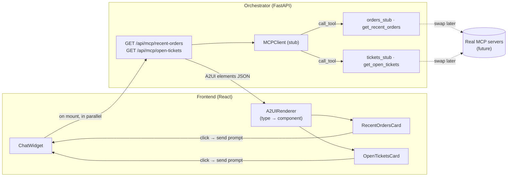
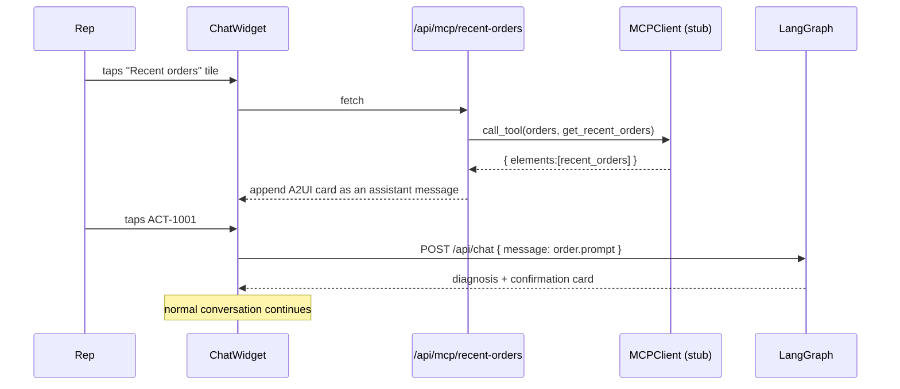

# A2UI — Agent-to-UI Elements in the Chat

**A2UI** (agent-to-UI) is Rep Assist's generative-UI layer. Instead of every
agent response being prose, tools can return **structured UI element specs** that
the chat renders as rich, interactive cards. The tool decides *what* to show; the
client decides *how* to render it. This keeps the agent↔UI contract explicit and
makes the chat feel like a workspace, not just a text box.

Six element types ship today. The default view leads with first-step CTA tiles
(see [Default chat view](#default-chat-view-first-step-ctas)); the rest are
revealed from the sidebar or returned inline by the graph:

- **Recent orders** — orders the rep has recently serviced (*orders* server). One
  tap picks up that order and starts the conversation.
- **Your open tickets** — the rep's currently-open tickets (*tickets* server).
- **System enhancements** — what's new in Rep Assist, in plain language (*system*
  server). Includes suggested questions **orchestrated back to the MCP** to answer.
- **The Opener** — the start-of-shift brief (*news* server; element type stays
  `morning_huddle` internally): a **To-Do checklist** plus emoji-rich **field news**
  (promos, launches, policy, network). Items are **managed on the Settings page**
  and can **link to an OST article**; the To-Do items are checkable.
- **Knowledge article** — the answer to a knowledge/how-to question (promo details,
  how to apply a discount, why a first bill is high), from the **OST (One Source of
  Truth)** server. Returned *inline by the graph* when triage routes a question to
  knowledge, and also opened from a "Read article" link in The Opener.
- **Store queue** — the current front-of-store check-in queue (*queue* server —
  the one MCP tool here that reads the app's own data instead of fronting a mock
  external system, see [doc 19](19-store-checkin-queue.md)). Tapping a waiting
  row's **Assist** claims it and starts a chat turn pre-filled with the
  customer's name/phone/visit reason.

No typing an order id or ticket number from memory.

> **Where the data comes from.** Elements are sourced from **MCP tools**. The
> prototype ships a *stubbed* MCP layer with mock data so the feature is fully
> functional offline; swapping in a real MCP service is a localized change
> (see [Extending](#extending-swap-the-stub-for-a-real-mcp-server)).

---

## Why it matters

| Outcome | How A2UI drives it |
|---|---|
| **Faster start** | The rep resumes recent work in one tap instead of recalling and typing an order id. |
| **Proactive context** | The agent surfaces what the rep is likely working on before they ask. |
| **Fewer errors** | Order ids, devices, and customers come from the system of record, not rep memory. |
| **Extensible surface** | A registry pattern means new element types (customer summary, plan comparison, device timeline) are additive — no chat rewrites. |

---

## Architecture



The MCP layer is a **boundary**, not just a function call: `MCPClient.call_tool()`
has the same shape a real MCP `tools/call` would, so the in-process stub can be
replaced with a real transport (stdio / streamable-HTTP / SSE) without touching
the API or the frontend.

---

## The A2UI element contract

An MCP tool returns an **envelope** of one or more elements:

```jsonc
{
  "elements": [
    {
      "type": "recent_orders",                 // discriminator the renderer switches on
      "title": "Recent orders",
      "subtitle": "Pick up where you left off …",
      "orders": [
        {
          "order_id": "ACT-1001",
          "order_type": "New Activation",
          "status": "Activation Pending",
          "status_tone": "warn",               // ok | warn | info | danger → colour
          "device": "iPhone 17 Pro",
          "line": "(555) 010-1001",
          "account_id": "AC-3001",
          "customer": "J. Rivera",
          "opened_label": "18m ago",
          "prompt": "Order ACT-1001 is stuck in activation, the SIM won't activate"
        }
      ]
    }
  ]
}
```

Two fields make an element renderable and interactive:

- **`type`** — the discriminator. `A2UIRenderer` maps it to a component; unknown
  types are ignored (forward-compatible), never fatal.
- **`prompt`** (per order) — the message sent through the normal chat flow when
  the rep acts on the item. This is what wires a click back into the LangGraph
  conversation.

---

## Backend — the stubbed MCP layer

```
backend/app/mcp/
├── __init__.py        # exports MCPClient, get_mcp_client
├── client.py          # MCPClient — in-process stand-in for a real MCP client
├── orders_stub.py     # "orders"  server: get_recent_orders      → recent_orders
├── tickets_stub.py    # "tickets" server: get_open_tickets        → open_tickets
├── system_stub.py     # "system"  server: get_system_enhancements → system_enhancements
│                       #                   answer_system_question  (system Q&A)
├── news_stub.py       # "news"    server: get_morning_huddle      → morning_huddle (DB-backed)
├── ost_stub.py        # "ost"     server: search_articles / get_article → knowledge_article
└── queue_stub.py      # "queue"   server: get_queue                → queue (DB-backed, live)
```

Each stub represents a **distinct upstream system** (orders, ticketing, product
release notes, field news, knowledge base), registered on the shared `MCPClient`
under its own server name. The **news** server reads its feed from the
`huddle_items` table (managed on the Settings page via `/api/huddle`); the **OST**
server is the knowledge base that answers how-to / "details about" questions.
The **queue** server is the one exception to "represents an upstream system" —
it reads the app's own `queue_entries` table (see
[doc 19](19-store-checkin-queue.md)), reusing the A2UI pipeline for consistency
rather than because it's fronting mock external data.

### `MCPClient` (stub)

A minimal in-process client. `register_tool(server, tool, fn)` mimics tool
discovery; `call_tool(server, tool, arguments)` mimics `tools/call`. A cached
singleton (`get_mcp_client()`) wires up the stub servers on first use.

```python
client = get_mcp_client()
client.call_tool("orders", "get_recent_orders", {"rep_id": "rep.demo", "limit": 6})
```

### `orders_stub` server

Holds the mock recent-orders fixture and the tone/"time ago" helpers, and returns
the `recent_orders` A2UI element. Everything here is deterministic mock data —
this is the single file to replace when the real orders service is available.

### API

One endpoint per element-producing MCP tool:

```
GET /api/mcp/recent-orders?rep_id=…   → recent_orders
GET /api/mcp/open-tickets?rep_id=…    → open_tickets
GET /api/mcp/system-enhancements      → system_enhancements
GET /api/mcp/morning-huddle           → morning_huddle
GET /api/mcp/ost-search?q=…           → knowledge_article (best match)
GET /api/mcp/ost-article?id=OST-1002  → knowledge_article (by id; used by huddle links)
GET /api/mcp/queue                    → queue (see doc 19 for the check-in/assist write endpoints)
```

Defined in [`backend/app/api/mcp.py`](../backend/app/api/mcp.py), registered in
[`backend/app/main.py`](../backend/app/main.py). The chat fetches each on demand
when its sidebar tile (or a huddle "Read article" link) is tapped. Two tools have
no HTTP endpoint — they're invoked from inside the graph: `answer_system_question`
(see [System Q&A](#system-qa-orchestrated-through-the-mcp)) and OST
`search_articles` (see [Knowledge answers](#knowledge-answers-inline-a2ui-from-ost)).

### Inline A2UI in chat responses

Besides the sidebar-revealed elements, the graph can return an A2UI element **as
part of a chat answer**. The `ChatResponse` carries an `a2ui` field (surfaced by
`_shape` from the last assistant message), and a chat message can hold text, a
resolution card, *and* A2UI elements. This is how OST knowledge answers arrive
(below).

### Knowledge answers (inline A2UI from OST)

When triage routes a question to the `general`/`billing` intent, the `knowledge`
node calls the **OST** server's `search_articles`. On a hit it attaches the
`knowledge_article` element to the composed reply (via the `article` state field);
on a miss it falls back to a ticket. So "how do I apply a discount?" comes back as
a short reply **plus a formatted article card**. The Morning-Huddle "Read article"
links call `ost-article` by id to reveal the same card on demand. The
**AI Assisted Resolution Desk** ([doc 03](03-hitl-ticketing-workflow.md#ai-assisted-resolution-desk))
is a second, non-chat consumer of the same `search_articles` tool — its
Analyze pass looks up a real article for `education`-bucketed tickets
instead of guessing one, and the rep can still override the AI's pick with a
manual article search.

### Voice input

The composer has a **mic button** (next to Send) for voice-to-text via the Web
Speech API (`webkitSpeechRecognition`). It's shown only where supported and
degrades gracefully otherwise. Code: `toggleMic` in
[`ChatWidget.tsx`](../frontend/src/components/ChatWidget.tsx).

---

## Frontend — the A2UI renderer

### Registry pattern

[`frontend/src/components/A2UI.tsx`](../frontend/src/components/A2UI.tsx) exports a
single renderer that switches on `element.type`:

```tsx
export function A2UIRenderer({ elements, onAction }) {
  return elements.map((el, i) => {
    switch (el.type) {
      case "recent_orders":
        return <RecentOrdersCard key={i} el={el} onAction={onAction} />;
      default:
        return null;   // unknown element types are ignored, not fatal
    }
  });
}
```

`onAction(prompt)` is the single callback every element uses to push a message
into the conversation.

### Wiring into the chat

Elements are fetched **on demand** from the sidebar "Look up" tiles and appended
to the transcript as an assistant message carrying the A2UI element(s). A chat
message can therefore hold text, a resolution card, and/or A2UI elements:

```tsx
async function showLookup(kind: "orders" | "tickets") {
  const res = kind === "orders" ? await api.recentOrders() : await api.openTickets();
  setMessages((m) => [...m, { role: "assistant", a2ui: res.elements }]);
}
// …in the message map:
{m.a2ui && <A2UIRenderer elements={m.a2ui} onAction={send} />}
```

`onAction={send}` means clicking an order/ticket reuses the exact same `send()`
path as typing — so the LangGraph triage → route → resolve → confirm flow runs
unchanged.

### Default chat view (first-step CTAs)

The default (empty) view leads with **CTA tiles** in the sidebar rather than
proactively-loaded data. Three tile groups:

- **First steps** — action CTAs (`Fix an activation`, `Unblock an order`, `Apply a
  promo`, `Explain a charge`, `Request a credit`). Tapping one **sends a starter
  prompt immediately**; the assistant then **asks a follow-up** for the specifics
  it needs (see [Clarify + slot-fill](#follow-up-questions-clarify--slot-fill)).
- **Look up** — `Recent orders`, `My open tickets` → reveal the A2UI card on demand.
- **Briefings** — `System enhancements`, `The Opener` → reveal the A2UI card.

This keeps the landing view uncluttered while the MCP-backed cards stay one tap
away.

### Follow-up questions (clarify + slot-fill)

Because a first-step tile sends a prompt with no id, the graph **asks for it**
instead of escalating. A `clarify` node returns the question (e.g. "what's the
order ID?") and records what it's `awaiting`. When the rep replies with the id,
`triage` **slot-fills**: it sees the `awaiting` field is now satisfied and resumes
the prior intent instead of re-classifying a bare "ACT-1001". The resolver then
runs normally. Code: `route_after_triage`, `clarify`, and the slot-fill block in
`triage` ([`backend/app/graph/nodes.py`](../backend/app/graph/nodes.py)).

### System Q&A (orchestrated through the MCP)

The System-enhancements card carries **suggested questions**, and the rep can also
type their own. A new **`system` intent** routes these to a `system_help` node
that calls the *system* MCP server's `answer_system_question` tool and returns its
answer — the MCP is the source of truth, the graph just orchestrates. Code: the
`system` intent in [`llm.py`](../backend/app/llm.py) + `schemas.py`, and the
`system_help` node in [`nodes.py`](../backend/app/graph/nodes.py).

### Types & API client

- [`types.ts`](../frontend/src/types.ts): `A2UIElement` (a union — extend it per
  element type), `A2UIRecentOrders`, `A2UIOrder`, `A2UIResponse`.
- [`api.ts`](../frontend/src/api.ts): `api.recentOrders(rep_id?)`.

---

## Interaction flow



---

## Extending: add a new element type

Two localized changes (this is exactly how **`open_tickets`** was added on top of
`recent_orders`):

1. **Backend** — add (or extend) an MCP tool that returns
   `{ "type": "your_element", … }` and register it on a stub server (e.g.
   `tickets_stub.register(client)` in `get_mcp_client()`), then expose an endpoint.
2. **Frontend** — add the interface to the `A2UIElement` union in `types.ts`, an
   `api.*()` method, and a `case "your_element"` in `A2UIRenderer` that renders your
   component.

The transport (`MCPClient`), the `onAction` callback, and the chat wiring stay
unchanged. Good next candidates: a **customer summary** card (account, plan,
tenure, open orders), a **plan comparison** table, or a **device upgrade
eligibility** widget.

## Extending: swap the stub for a real MCP server

Keep `MCPClient.call_tool()`'s signature and move the dispatch onto a real MCP
transport (e.g. the `mcp` Python SDK over stdio or streamable-HTTP). Point it at
the production Orders MCP server, map its `tools/call` result into the
`recent_orders` element shape (or have the server return A2UI elements directly),
and delete `orders_stub.py`. Nothing in `api/mcp.py` or the frontend changes.

---

## File manifest

| File | Role |
|---|---|
| `backend/app/mcp/client.py` | `MCPClient` stub — the swappable MCP boundary |
| `backend/app/mcp/orders_stub.py` | "orders" server + mock recent-orders data |
| `backend/app/mcp/tickets_stub.py` | "tickets" server + mock open-tickets data |
| `backend/app/mcp/system_stub.py` | "system" server: enhancements + `answer_system_question` |
| `backend/app/mcp/news_stub.py` | "news" server: DB-backed The Opener feed (To-Do + news) |
| `backend/app/mcp/ost_stub.py` | "ost" server: knowledge articles (`search_articles` / `get_article`) |
| `backend/app/mcp/__init__.py` | Exports `MCPClient`, `get_mcp_client` |
| `backend/app/api/mcp.py` | The six element endpoints |
| `backend/app/api/huddle.py` | The Opener CRUD + OST article picker (Settings) |
| `backend/app/store/models.py` | `HuddleItem` model |
| `backend/app/graph/nodes.py` | `clarify`, `system_help`, OST `knowledge`, slot-fill in `triage` |
| `backend/app/graph/orchestrator.py` | Wires nodes; `a2ui` in `_shape` |
| `backend/app/schemas.py`, `llm.py` | `system` intent + knowledge/how-to routing |
| `frontend/src/components/A2UI.tsx` | `A2UIRenderer` registry + the five card components |
| `frontend/src/components/ChatWidget.tsx` | CTA tiles, inline a2ui, article open, mic |
| `frontend/src/components/SettingsPage.tsx` | The Opener management section |
| `frontend/src/types.ts` | `A2UIElement` union + element/huddle interfaces |
| `frontend/src/api.ts` | MCP element methods + huddle CRUD |
| `frontend/src/styles.css` | `a2ui-*` + `cta-*` + mic styles |
