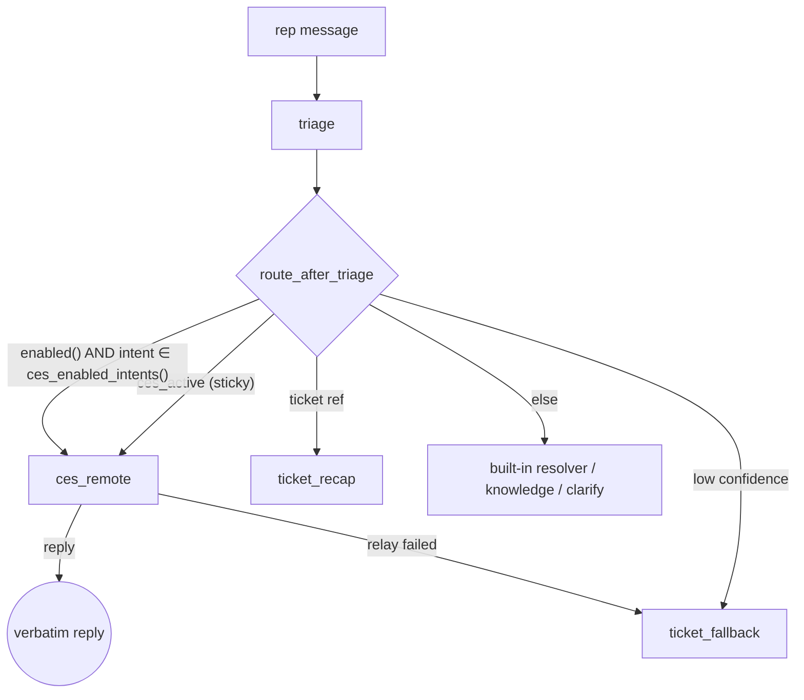

# CES Agent Routing

Rep Assist can **relay selected triage intents to an external Google CX Agent
Studio (CES) agent** instead of handling them with its own built-in resolver or
knowledge lookup. Routing is **per-intent** and switched on/off live from
**Settings → CES Routing** — a manager decides which lanes (billing, activation,
promo, …) the external agent owns, and the change takes effect on the rep's next
message.

The reference target is the live **`repAssist`** CES deployment — a multi-agent
telecom app (a root *Telecommunications Steering* agent plus **Accounts,
Billing, Technical Support, Usage, Plans, Disconnect, Equipment, Payments**
sub-agents). Because the whole call is hidden behind one client module, the same
seam works for any CES deployment, and the transport can later swap from
`runSession` to A2A `message:send` with zero orchestrator impact.

Code: [`graph/nodes.py`](../backend/app/graph/nodes.py) (`ces_remote`),
[`integrations/ces_client.py`](../backend/app/integrations/ces_client.py),
[`api/settings.py`](../backend/app/api/settings.py),
[`store/models.py`](../backend/app/store/models.py) (`CesRoute`),
[`SettingsPage.tsx`](../frontend/src/components/SettingsPage.tsx).

---

## Two clean separations

| Concern | Where it lives | Why |
|---|---|---|
| **Connection** — which deployment, where (sensitive) | env / Secret Manager (`CES_DEPLOYMENT`, `CES_APP_VERSION`, `CES_LOCATION`, `CES_STUB`) | Gates the whole feature; `ces_client.enabled()` is `bool(CES_DEPLOYMENT)`. |
| **Routing policy** — which intents go to CES | `ces_routes` DB table, managed from Settings | Read **live every turn** so toggles take effect on the next message, like the `hidden_enhancements` pattern. |

An empty `CES_DEPLOYMENT` turns the feature off entirely: the Settings page shows
"Not configured," the toggles are disabled, and every existing flow is unchanged.

---

## How a turn is routed



The CES check sits **after** the ticket-reference and confidence guards but
**before** the "missing id → clarify" gate — CES self-slot-fills (it asks the
customer for what it needs), so we relay even when an id is missing instead of
stopping to ask the rep for one.

**Sticky continuation.** Once a turn is relayed, `ces_active` is set on the
LangGraph checkpoint and the thread **stays** with CES on subsequent turns — even
a bare follow-up like *"the last four digits are 4821"* that would otherwise
classify as low-confidence `other`. A stable `ces_session_id` is threaded so the
CES session keeps multi-turn context. The rep leaves the sub-conversation with a
**hand-back phrase** (*"back to rep assist"*, *"exit ces"*, …), which `triage`
detects and clears, returning the thread to normal routing.

**Verbatim, not re-voiced.** `ces_remote` surfaces the external agent's reply
**as-is** and ends the turn (like `system_help`/`ticket_recap`) rather than
routing through `compose`, which would re-write it with the LLM and lose the
agent's actual words. The reply card is `status: "info"` (a relayed
conversational turn, not a closed resolution) tagged
`CES · repAssist[ · <entry agent>]`.

---

## The client — `runSession` with an offline stub

[`ces_client.run_turn(session_id, text, entry_agent=None)`](../backend/app/integrations/ces_client.py)
is the single call point. The proven method is CES **`runSession`** (v1beta),
authenticated with the Cloud Run service account (ADC):

```
POST https://ces.googleapis.com/v1beta/{…/sessions/{id}}:runSession
  header  x-goog-request-params: location=locations/us
  body    {config:{session, deployment, appVersion?, entryAgent?}, inputs:[{text}]}
  →       {outputs:[{text, turnCompleted, …}]}
```

Multi-turn = reuse the same `session` id (derived once per thread). Known
ids/entities are pre-filled into the relayed text so the steering agent can skip
slot-filling — the same trick the built-in resolvers use.

**Offline by design.** With `CES_STUB=true`, no deployment, or *any* error
reaching the live API, `run_turn` returns a deterministic in-process stub reply —
the same graceful-fallback pattern as `agents_client._stub_*`. This makes the
node, the routing, and the Settings toggle fully testable and demoable without
GCP credentials. See [`test_ces_routing.py`](../backend/tests/test_ces_routing.py)
(7 contract tests: routing on/off, verbatim relay, entry agent, sticky
continuation + hand-back, Settings API validation).

> **A2A is a deliberate non-choice (for now).** The deployment advertises A2A
> (`message:send`, `extendedAgentCard`), but inbound A2A returns an opaque
> `400 INVALID_ARGUMENT` even with a spec-compliant body, and there's no A2A
> channel/enablement to flip. `runSession` is the working method today; because
> the call is isolated in `ces_client`, switching to `message:send` later (if
> Google enables inbound A2A) is a ~10-line internal change.

---

## Settings API + UI

`GET /api/settings/ces-routing` returns the connection status
(`configured`, `stubbed`, `deployment`) and one row per **routable** intent
(everything except `system` — Rep Assist's own product Q&A is never delegated),
each with `enabled`, `entry_agent`, and `has_resolver` (so the UI can say CES
*overrides* a built-in resolver vs. *adds* capability). `POST` upserts one
intent's rule into `ces_routes`.

The **CES Routing** section of the Settings page shows a connection banner
(reusing the SMTP-badge styling) plus a per-intent table with a **CES /
Built-in** toggle and an optional entry-agent `<select>` (the eight domain
sub-agents), with optimistic updates mirroring the enhancement-visibility toggle.

---

## Configuration

| Env var | Default | Purpose |
|---|---|---|
| `CES_DEPLOYMENT` | `""` | `projects/…/apps/{app}/deployments/{dep}`. **Empty → feature off.** Setting it flips the feature on. |
| `CES_APP_VERSION` | `""` | Optional `projects/…/apps/{app}/versions/{ver}` pin. |
| `CES_LOCATION` | `us` | Region for the `x-goog-request-params` header. |
| `CES_STUB` | `false` | `true` → always use the in-process stub reply (offline demo/tests). Leave unset to attempt the live call (with stub fallback on error). |

**Going truly live** (real CES calls): set `CES_DEPLOYMENT`, set
`CES_STUB=false`, and grant the Cloud Run runtime service account a CES-invoke
IAM role for `ces.googleapis.com` (the app and the reference `repAssist`
deployment are in the same project, so this is an IAM grant, not new
networking). Until then, the deployed feature runs in **stub mode** — fully
demoable, no external calls, no credentials.

---

## Governance

`ces_remote` is an **advisory relay** — it never executes a write. The
rep-confirmation `interrupt()` gate ([doc 02](02-langgraph-orchestration.md))
still governs any account change made by a built-in resolver. If CES's
Payments/Disconnect sub-agents are later allowed to mutate, route those proposals
through the same `interrupt()` + `record_action_audit` path.
