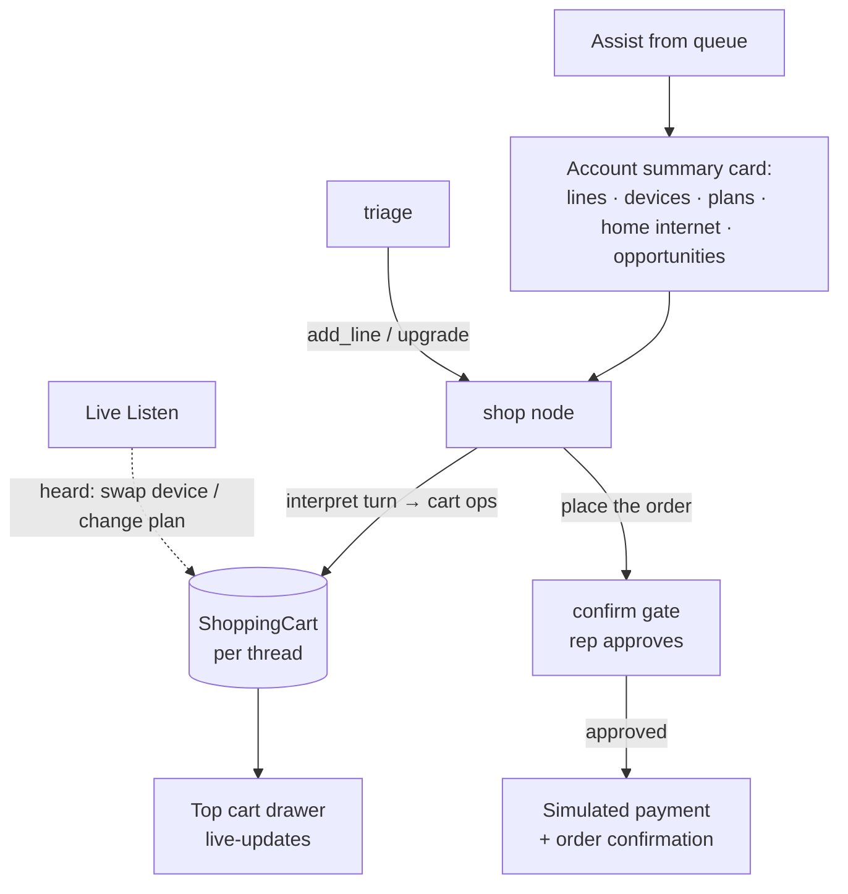

# In-Chat Shopping (Add a Line / Upgrade)

A guided **sales** flow inside the rep chat: pull up a customer's account, build a
cart by talking to the assistant (add a line, upgrade a device, pick a plan,
apply a promo), and place the order behind the same rep-confirmation gate that
guards every account change — with a **simulated** payment (never a real charge).
When **Live Listen** is on, cart edits heard in the conversation are applied to
the cart live.

Code: [`shop.py`](../backend/app/shop.py) (cart engine),
[`mock_services/shop_data.py`](../backend/app/mock_services/shop_data.py)
(catalog + account profiles), [`graph/nodes.py`](../backend/app/graph/nodes.py)
(`shop` node + the checkout branch of `confirm`),
[`api/shop.py`](../backend/app/api/shop.py),
[`api/listen.py`](../backend/app/api/listen.py) (`_cart_from_listen`),
[`ChatWidget.tsx`](../frontend/src/components/ChatWidget.tsx) (`CartDrawer`),
[`A2UI.tsx`](../frontend/src/components/A2UI.tsx) (account + order cards).

---

## The flow

1. **Account summary.** Assisting a queue customer fetches
   `GET /api/shop/account` and shows their current lines (phone/tablet/watch),
   plans, home internet (fiber/FWA), upgrade-eligibility, and the sales
   opportunities to position — with **+ Add a line / ⇪ Upgrade a line** actions.
2. **Intents.** `add_line` / `upgrade` route to a **sticky** `shop` node. Each
   turn is interpreted by `llm.interpret_shop_turn` (Claude structured output →
   `ShopTurn{ops[], reply}`) with a deterministic offline fallback, then applied
   to the thread's cart by `shop.apply_ops` (matching the catalog, costing each
   item, auto-attaching the account's upgrade promo).
3. **Cart drawer.** Every chat turn returns the updated cart; the frontend
   renders it in a **top drawer** that opens/closes and live-updates.
4. **Checkout.** "Place the order" proposes an order and routes to the existing
   `interrupt()` **confirmation gate**. On approval, `confirm` places the order
   and **simulates** payment (`shop.place_order`), records a `ShopOrder` + an
   `action_audit` row, clears the cart, and shows an order-confirmation card.
5. **Live Listen.** While a cart is in progress, `_cart_from_listen` interprets
   the *newest* utterances (behind a cheap keyword pre-filter, idempotent) and
   applies cart edits heard in the conversation, so the drawer updates as the
   rep and customer talk.

---

## Data + state

- **Catalog** (`shop_data.py`): 8 devices (phones/tablets/watches), 5 plans,
  4 promos, 2 home-internet products. Prices are illustrative (device payment
  over a 36-month term).
- **Account profiles**: per-account lines (device + type + plan +
  upgrade-eligibility) and home internet, keyed to the same account ids the
  resolver scenarios use; unknown accounts get a sensible default.
- **`ShoppingCart`** table (JSON items, keyed by `thread_id`) — the draft cart;
  **`ShopOrder`** table — the placed-order receipt.
- `GraphState.shop_active` (sticky session) and `GraphState.cart` (the view the
  drawer reads, surfaced on every `/api/chat` response).

---

## Governance & payment

- **Payment is simulated.** No real card is entered or charged — checkout records
  a demo receipt with a masked mock card, exactly like the other stub services.
- **The confirm gate is authoritative.** Placing an order goes through the same
  rep-approval `interrupt()` that guards account changes, and writes an
  `action_audit` row — the cart itself (built via chat or Live Listen) is only a
  *draft* until the rep approves at checkout.

---

## Tests

[`test_shop.py`](../backend/tests/test_shop.py) — offline (rule-based
interpreter): add-line, sticky edit, upgrade auto-promo, exit, checkout
confirm/place, decline-keeps-cart, Live-Listen cart mutation + pre-filter, and
the `/api/shop/*` endpoints.
