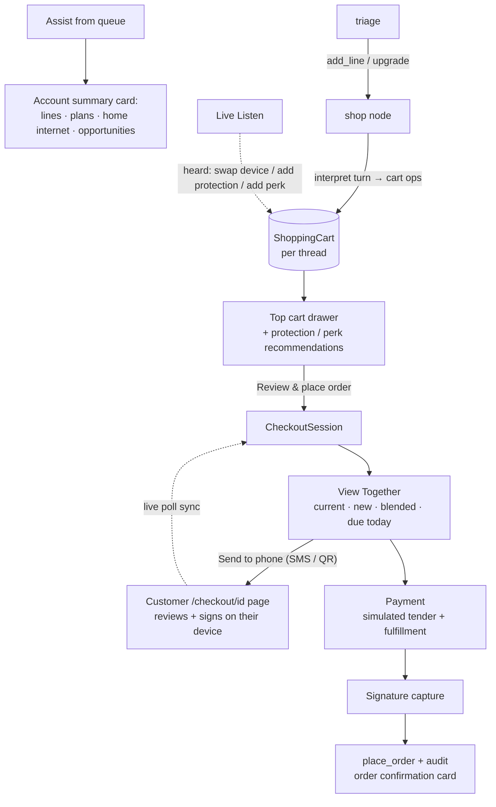

# In-Chat Shopping + POS Checkout (Add a Line / Upgrade)

A guided **sales** flow inside the rep chat: pull up a customer's account, build a
cart by talking to the assistant (add a line, upgrade a device, pick a plan,
apply a promo, attach **protection / perks / accessories / a trade-in**), then run
a full **wireless-store POS checkout** — a **View Together** bill review, a
**payment** step, and a captured **signature** — with a **simulated** payment
(never a real charge). The checkout can be **handed off to the customer's phone**
(SMS link or scannable QR) so they review and sign on their own device while the
rep's screen live-syncs. When **Live Listen** is on, cart edits heard in the
conversation are applied live.

Code: [`shop.py`](../backend/app/shop.py) (cart engine + costing + quote),
[`checkout.py`](../backend/app/checkout.py) (the checkout-session engine),
[`mock_services/shop_data.py`](../backend/app/mock_services/shop_data.py)
(catalog + fees + account profiles),
[`graph/nodes.py`](../backend/app/graph/nodes.py) (`shop` node + the checkout
branch of `confirm` — the composer fallback),
[`api/shop.py`](../backend/app/api/shop.py),
[`api/checkout.py`](../backend/app/api/checkout.py) (the wizard endpoints),
[`api/listen.py`](../backend/app/api/listen.py) (`_cart_from_listen`),
[`ChatWidget.tsx`](../frontend/src/components/ChatWidget.tsx) (`CartDrawer`, wizard wiring),
[`Checkout.tsx`](../frontend/src/components/Checkout.tsx) (`CheckoutFlow` step cards),
[`CustomerCheckout.tsx`](../frontend/src/components/CustomerCheckout.tsx) (the customer phone page),
[`A2UI.tsx`](../frontend/src/components/A2UI.tsx) (account card).

---

## The flow

1. **Account summary.** Assisting a queue customer fetches
   `GET /api/shop/account` and shows their current lines, plans, home internet,
   upgrade-eligibility, the opportunities to position, and (existing customers)
   their **current monthly** estimate — with **+ Add a line / ⇪ Upgrade a line**.
2. **Cart building.** `add_line` / `upgrade` route to a **sticky** `shop` node.
   Each turn is interpreted by `llm.interpret_shop_turn` (Claude structured output
   → `ShopTurn{ops[], reply}`) with a deterministic offline fallback, then applied
   by `shop.apply_ops`. Beyond device/plan/promo, the ops now cover
   **`add_protection` / `decline_protection`, `add_perk` / `remove_perk`,
   `add_accessory`, `set_fulfillment`, `set_trade_in`**.
3. **Cart drawer + recommendations.** Every turn returns the updated cart in a
   **top drawer**. `cart_view` also returns deterministic **recommendations** —
   protection is **always** recommended for a device line that has none, and a
   perk is suggested once — surfaced as one-tap chips that send a natural-language
   attach prompt back through the same interpreter.
4. **Checkout wizard.** **Review & place order** opens a server-side
   **`CheckoutSession`** (`POST /api/shop/checkout/start`) and steps through:
   - **View Together** — current monthly (existing customers) vs. the new
     recurring vs. the **blended** next-month total, plus the **one-time charges
     due today** (always taxes + an activation fee per new/upgraded line, plus any
     accessories), itemized.
   - **Payment** — a simulated tender (card-on-file / tap / wallet) + fulfillment
     choice (in-store pickup / ship).
   - **Signature** — a canvas capture; on sign, `shop.place_order` records the
     order + an `action_audit` row, clears the cart, and shows the order
     confirmation. An optional text/email **receipt** is a mock preview.
5. **Phone hand-off (full sync).** From View Together the rep can **Send to
   phone** — an **SMS** to the customer's primary number (mock preview) or a
   scannable **QR** (`segno`, SVG data-URI). Both open `/checkout/{id}` on the
   customer's device (`CustomerCheckout.tsx`, routed in `main.tsx`), driving the
   **same** session. Rep and phone both poll `GET /api/shop/checkout/{id}` (~2.5s)
   so they stay in lock-step — the customer can pick payment and sign on their own
   phone and the rep's screen advances to the confirmation.
6. **Live Listen.** While a cart is in progress, `_cart_from_listen` interprets
   the *newest* utterances (cheap keyword pre-filter now also matches
   protection/perk/accessory) and applies cart edits heard in the conversation.
7. **Composer fallback.** Typing "place the order" still routes through the
   original graph `confirm` gate (`shop.wants_checkout` → `confirm` → `place_order`),
   so the wizard is **additive** and the old path keeps working (and its tests pass).

---

## Merchandising catalog + costing

`shop_data.py`:

- **Devices** (8, phones/tablets/watches), **plans** (5), **promos** (4),
  **home internet** (2) — prices illustrative, devices financed over a 36-month term.
- **Protection** (`PROTECTION`) — per-device insurance by device type; **always
  recommended** when a device is added (`cart_view().recommendations`).
- **Perks** (`PERKS`) — YouTube TV, Netflix, Max, Apple One, Disney+ Bundle, sold
  at the wireless perk price ($10/mo each). Each is its own `kind:"perk"` cart line.
- **Accessories** (`ACCESSORIES`) — case, screen protector, charger, earbuds —
  one-time-charge `kind:"accessory"` lines (taxed).
- **Fees & tax** — `ACTIVATION_FEE` per new/upgraded line + `TAX_RATE` on device
  retail + accessories, collected at checkout as **due today**.

`shop.checkout_quote(items, account)` computes the View Together math:
`current_monthly` (existing customer), `recurring_monthly`, `blended_monthly`,
`activation_fees`, `taxes`, `accessories_onetime`, `due_today`, plus itemized
`recurring_lines` / `onetime_lines`. A trade-in attaches the trade-in promo (so
the credit flows into financing) and records `{device, credit}` for display.

---

## Data + state

- **`ShoppingCart`** (JSON items keyed by `thread_id`) — the draft cart. Items
  gained `protection`, `trade_in`, `fulfillment`, and `kind` values `perk` /
  `accessory`.
- **`ShopOrder`** — the placed-order receipt; extended with `taxes`,
  `activation_fees`, `onetime_breakdown`, `perks`, `fulfillment`, `signed_at`,
  `signature_ref`, `receipt_channel` (additive `ALTER TABLE` migrations).
- **`CheckoutSession`** — the id-addressable wizard session (items + quote
  snapshot, `step`, payment method, fulfillment, signature ref, order id) so the
  rep screen **and** the customer phone drive the same checkout.
- `GraphState.shop_active` (sticky) + `GraphState.cart` (the drawer view, on every
  `/api/chat` response).

---

## Governance & payment

- **Payment is simulated.** No real card is entered or charged — a tender is
  *selected* and a demo receipt is recorded with a masked mock card. SMS + receipt
  are mock previews (mirroring `email_reports.py`'s preview mode).
- **Signature is a demo artifact.** Stored as a compact, non-PII reference (a hash
  of the drawn image, or a "typed-signature" marker) — the raw image is never persisted.
- **The order is recorded only at signature**, with an `action_audit`
  (`operation="place_order"`) row — the same authoritative approval point as the
  graph confirm gate. The cart (built via chat or Live Listen) is only a *draft*
  until then.

---

## API — `/api/shop/checkout`

| Route | Purpose |
|---|---|
| `POST /start` | Snapshot the thread's cart into a session → View Together element |
| `GET /{id}` | Current session + step element (rep + phone both poll this) |
| `POST /{id}/advance` | review → payment |
| `POST /{id}/pay` | select tender + fulfillment → signature |
| `POST /{id}/sign` | capture signature → place order + confirmation |
| `POST /{id}/send-to-phone` | `sms` (mock preview) or `qr` (SVG data-URI) of `/checkout/{id}` |

Read endpoints (`api/shop.py`) unchanged: `GET /account`, `/catalog`, `/cart/{thread_id}`.

---

## Tests

[`test_shop.py`](../backend/tests/test_shop.py) — offline cart engine (add-line,
sticky edit, upgrade auto-promo, exit, composer-checkout confirm/place,
decline-keeps-cart, Live-Listen mutation + pre-filter, `/api/shop/*`).
[`test_checkout.py`](../backend/tests/test_checkout.py) — protection/perk/accessory
ops + totals, the always-on protection recommendation, `checkout_quote` math
(taxes + activation + accessories → due today; blended monthly), the checkout
lifecycle (start → advance → pay → sign) placing a `ShopOrder` with the breakdown
+ an audit row + a cleared cart, the phone-sync `GET` contract, and send-to-phone
(SMS preview + QR data-URI). Added dependency: `segno` (pure-Python QR).
